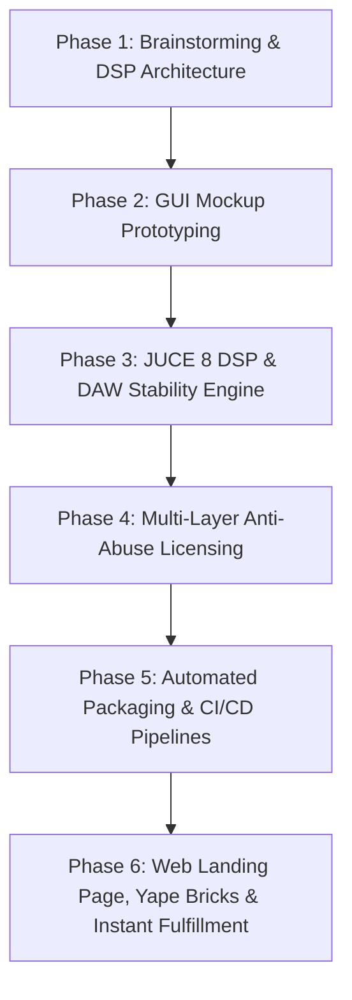

---
name: juce-plugin-creator
description: Standard instructions, end-to-end development workflow, security architecture, DAW stability standards, and installer/packaging standards for creating, compiling, and distributing OFFSZN JUCE VST3/AU audio plugins (Easy Mix, Easy Master, Inka Kola, Sample, Vocal Preset, etc.).
---

# OFFSZN JUCE VST3/AU Plugin Creator & Licensing Architecture

This skill defines the mandatory technical standards, anti-abuse security patterns, DAW stability rules, and development lifecycle for all OFFSZN VST3 and AudioUnit (AU) audio plugins across Windows and macOS.

> **Reference Product:** **Easy Mix** is the gold standard. Every new plugin MUST match or exceed its quality, security, and UX architecture.

---

## 🧭 End-to-End Plugin Lifecycle Workflow



---

## 🎨 Phase 1: Brainstorming & DSP Architecture Planning

1. Define plugin purpose, brand name, product code (4 chars: e.g., `Esym`, `Voca`), manufacturer code `Ofsz`.
2. List all automatable parameters, default values, skew curves, and units (dB, Hz, ms, %).
3. Choose Licensing Tier: `Free/Gift` (no serial) or `Commercial/Trial` (online activation + offline tamper-resistant `.settings`).

---

## 🖥️ Phase 2: Local GUI Architecture & Offline-First Design (mockup.html)

**Local-First HTML Loading:** Always load from `%APPDATA%\OFFSZN\<PluginGuiFolder>\mockup.html`.

### ✅ THE GOLDEN RULE — DO NOT SPAM SERVER

- **NEVER** call `/api/plugin/activate` on every plugin launch.
- On startup, call `callNative("getLicenseState")` → C++ validates locally.
- If `isValid == true`: trust C++, calculate remaining days locally from timestamp, show badge.
- **Only trigger online fetch** when: (a) user enters a new key, or (b) C++ flags `isValid == false`.
- Schedule 5-hour periodic audit (`setInterval`) **silently in background** — never block audio or UI.

### ✅ Correct Offline-First Startup Flow

```javascript
var LICENSE_CHECK_INTERVAL_MS = 18000000; // 5 hours

callNative("getLicenseState").then(function(state) {
  var isValid = state && state.isValid;
  var rawSerial = (state && state.serial || "").trim();

  if (rawSerial) {
    var isTrial = rawSerial.toUpperCase().indexOf("TRIAL-") !== -1;
    if (isTrial) {
      if (isValid) {
        // Parse timestamps: SERIAL|EXPIRES_UNIX|LAST_CHECK_UNIX
        var tokens = rawSerial.split("|");
        var trialSerial = tokens[0];
        var expiresUnix = tokens.length > 1 ? parseInt(tokens[1], 10) : 0;
        if (expiresUnix > 0) {
          var daysLeft = Math.ceil((expiresUnix - Math.floor(Date.now() / 1000)) / 86400);
          updateTrialBadge(true, daysLeft > 1 ? daysLeft + " DÍAS" : "ÚLTIMO DÍA");
        } else {
          updateTrialBadge(true, "3 DÍAS");
        }
        // Silent background check (fire & forget, safe offline fallback)
        getHwidAsync().then(function(hwid) {
          fetch(apiBase + "/api/plugin/activate", {
            method: "POST", headers: {"Content-Type":"application/json"},
            body: JSON.stringify({ serial_key: trialSerial, hwid: hwid || getOrCreateDeviceId(), plugin_name: "<Plugin Name>" })
          }).then(function(r){ return r.json(); }).then(function(resp){
            if (resp && !resp.success) triggerLicenseExpired("Prueba Expirada", resp.error);
          }).catch(function(err){
            console.log("[Trial] Offline — continuing with local validation:", err);
          });
        });
        setInterval(performPeriodicLicenseAudit, LICENSE_CHECK_INTERVAL_MS);
      } else {
        triggerLicenseExpired("Prueba Expirada", "Tu periodo de prueba ha expirado.");
      }
    } else {
      // FULL key: 100% offline forever
      if (isValid) { updateTrialBadge(false); }
      else { callNative("setLicenseStatus", false); openActivationModal(false); }
    }
  } else {
    openTrialOrActivationModal();
  }
});
```

### ✅ 5-Hour Periodic License Audit (Silent & Non-Blocking)

```javascript
function performPeriodicLicenseAudit() {
  callNative("getLicenseState").then(function(state) {
    if (!state || !state.isValid) {
      triggerLicenseExpired("Licencia Inválida", "La validación de tu licencia falló.");
      return;
    }
    var rawSerial = (state.serial || "").trim();
    if (rawSerial.toUpperCase().indexOf("TRIAL-") === -1) return; // FULL = no re-validation
    var tokens = rawSerial.split("|");
    var trialSerial = tokens[0];
    var expiresUnix = tokens.length > 1 ? parseInt(tokens[1], 10) : 0;
    if (expiresUnix > 0 && Math.floor(Date.now() / 1000) >= expiresUnix) {
      callNative("setLicenseStatus", false);
      triggerLicenseExpired("Prueba Expirada", "Tu periodo de prueba ha expirado.");
      return;
    }
    // SAFE FALLBACK: if offline during periodic check, trust local state
    getHwidAsync().then(function(hwid) {
      fetch(apiBase + "/api/plugin/activate", {
        method: "POST", headers: {"Content-Type":"application/json"},
        body: JSON.stringify({ serial_key: trialSerial, hwid: hwid || getOrCreateDeviceId(), plugin_name: "<Plugin Name>" })
      }).then(function(r){ return r.json(); }).then(function(resp){
        if (resp && !resp.success) {
          callNative("setLicenseStatus", false);
          triggerLicenseExpired("Prueba Revocada", resp.error);
        }
      }).catch(function(err){
        console.log("[Audit] Offline — maintaining local state:", err);
      });
    });
  });
}
```

### ✅ Trial Local Fallback (When Server Unreachable at First Request)

```javascript
function startLocalTrialFallback() {
  // ONLY call from network error catch block — NEVER from UI button alone
  var rand = Math.random().toString(36).substring(2, 10).toUpperCase();
  var nowUnix = Math.floor(Date.now() / 1000);
  var expUnix = nowUnix + (3 * 86400); // 72 hours
  var trialKey = "<PREFIX>-TRIAL-" + rand;
  var fullStored = trialKey + "|" + expUnix + "|" + nowUnix;
  try { localStorage.setItem("offszn_serial", trialKey); } catch(e) {}
  callNative("setLicenseStatus", true, fullStored);
  updateLicenseBadge("trial", "PRUEBA · 3 DÍAS");
  closeActivationModal();
  setInterval(performPeriodicLicenseAudit, LICENSE_CHECK_INTERVAL_MS);
}
```

> [!CAUTION]
> `startLocalTrialFallback()` must ONLY be called from a network error `catch` block. The server remains the authoritative source of truth.

---

## ⚡ Phase 3: JUCE 8 C++ DSP & DAW Crash-Prevention Standards

### 🛡️ Mandatory DAW Stability Rules

| Problem | Root Cause | Fix |
|---|---|---|
| **COM Threading** | Ableton/Cubase open VST3 GUIs on non-COM threads → WebView2 crashes DAW | `CoInitializeEx(nullptr, COINIT_APARTMENTTHREADED)` at top of Editor constructor |
| **Multi-Instance File Lock** | Shared WebView2 cache → SQLite `.lock` collision | Isolated folder `AppData/Roaming/OFFSZN/<PluginName>WV2` |
| **Use-After-Free** | Rapid open/close with pending async → `this` dangling pointer | `SafePointer<MyEditor> safeThis(this); if (safeThis == nullptr) return;` |
| **Destructor Timer** | 30Hz timer fires on null WebView during destruction | `stopTimer(); webComponent = nullptr;` in destructor |
| **Mono Track Crash** | Rejecting mono in `isBusesLayoutSupported` → crash on mono vocal tracks | Allow both mono and stereo if `mainOutput == mainInput` |
| **Denormal Floats** | Infinite floating-point fractions in IIR/reverb → CPU 100% | `juce::ScopedNoDenormals noDenormals;` at start of `processBlock` |

#### Bulletproof `PluginEditor.cpp` Boilerplate
```cpp
#include "PluginProcessor.h"
#include "PluginEditor.h"
#if JUCE_WINDOWS
 #include <objbase.h>
#endif

MyAudioProcessorEditor::MyAudioProcessorEditor(MyAudioProcessor& p)
    : AudioProcessorEditor(&p), audioProcessor(p)
{
#if JUCE_WINDOWS
    CoInitializeEx(nullptr, COINIT_APARTMENTTHREADED);
    juce::File wv2Folder = juce::File::getSpecialLocation(juce::File::userApplicationDataDirectory)
        .getChildFile("OFFSZN").getChildFile("<PluginName>WV2");
    wv2Folder.createDirectory();
    auto options = juce::WebBrowserComponent::Options{}
        .withBackend(juce::WebBrowserComponent::Options::Backend::webview2)
        .withNativeIntegrationEnabled()
        .withWinWebView2Options(juce::WebBrowserComponent::Options::WinWebView2{}
            .withUserDataFolder(wv2Folder).withStatusBarDisabled().withBuiltInErrorPageDisabled())
#else
    auto options = juce::WebBrowserComponent::Options{}.withNativeIntegrationEnabled()
#endif
        .withNativeFunction("setParam", [this](const juce::Array<juce::var>& args, auto complete) {
            if (args.size() >= 2) {
                juce::String id = args[0].toString();
                float val = (float)args[1];
                juce::Component::SafePointer<MyAudioProcessorEditor> safeThis(this);
                juce::MessageManager::callAsync([safeThis, id, val] {
                    if (safeThis == nullptr) return;
                    safeThis->audioProcessor.setParamFromUI(id, val);
                });
            }
            complete(juce::var());
        });

    webComponent = std::make_unique<MyWebBrowser>(options);
    juce::File guiFile = juce::File::getSpecialLocation(juce::File::userApplicationDataDirectory)
        .getChildFile("OFFSZN").getChildFile("<PluginName>Gui").getChildFile("mockup.html");
    webComponent->goToURL(guiFile.existsAsFile()
        ? "file:///" + guiFile.getFullPathName().replaceCharacter('\\', '/')
        : "https://offszn.lat/plugins/<slug>?v=1");
    addAndMakeVisible(*webComponent);
    setSize(1000, 530);
    startTimerHz(30);
}

MyAudioProcessorEditor::~MyAudioProcessorEditor() {
    stopTimer();
    webComponent = nullptr;
}
```

#### Universal Bus Layout
```cpp
bool MyAudioProcessor::isBusesLayoutSupported(const BusesLayout& layouts) const {
    if (layouts.getMainOutputChannelSet() != juce::AudioChannelSet::mono()
     && layouts.getMainOutputChannelSet() != juce::AudioChannelSet::stereo())
        return false;
    if (layouts.getMainOutputChannelSet() != layouts.getMainInputChannelSet())
        return false;
    return true;
}
```

---

## 🔒 Phase 4: Multi-Layer Anti-Abuse Licensing Architecture

**Security Philosophy:** Never trust client-side JavaScript. C++ is the authoritative enforcement gate.

### Core Rules
1. **First-time activation requires internet** → reject offline activations of raw unverified strings.
2. **Permanent offline execution once activated** → C++ reads `.settings` locally on every subsequent launch.
3. **Anti-tamper clock rewind detection** → if `now < lastCheck - 3600`, revoke immediately.
4. **Installer never overwrites `.settings`** → user data preserved across updates.
5. **DSP gate** → `if (!isLicenseValid.load()) { buffer.clear(); return; }`
6. **Badge behavior** → PRUEBA·X DÍAS (amber), FULL·OFFSZN (green), DEMO·ACTIVAR (red). Hard-lock modal when expired (no close button).
7. **5-hour silent audit** → `setInterval(performPeriodicLicenseAudit, 18000000)`. Offline → safe fallback.
8. **Trial generation security** → `startLocalTrialFallback()` only from network `catch` blocks.

```mermaid
sequenceDiagram
    participant JS as Frontend (mockup.html)
    participant CPP as C++ Native Engine
    participant SVR as OFFSZN Server

    Note over JS,CPP: Startup (Offline-First)
    CPP->>CPP: Read .settings → check timestamps & clock tamper
    JS->>CPP: callNative("getLicenseState")
    CPP-->>JS: { isValid: true/false, serial }

    Note over JS,SVR: New Key Activation
    JS->>SVR: POST /api/plugin/activate (serial, hwid)
    SVR-->>JS: { success, license_type, expires_at }
    JS->>CPP: callNative("setLicenseStatus", true, serial)
    CPP->>CPP: Write .settings → isLicenseValid.store(true)

    Note over JS,SVR: 5-Hour Audit (Background)
    JS->>SVR: POST /api/plugin/activate (trial serial, hwid)
    alt Server revoked
        JS->>CPP: callNative("setLicenseStatus", false)
        CPP->>CPP: processBlock → buffer.clear(); return;
    else Offline
        JS->>JS: Trust C++ local state (safe fallback)
    end
```

### C++ Anti-Tamper & Settings Verification
```cpp
if (settingsFile.existsAsFile()) {
    juce::String content = settingsFile.loadFileAsString().trim();
    if (content.startsWith("<PREFIX>-FULL-")) {
        isLicenseValid.store(true);
    } else if (content.startsWith("<PREFIX>-TRIAL-")) {
        auto tokens = juce::StringArray::fromTokens(content, "|", "");
        int64_t expiresAt = tokens.size() > 1 ? tokens[1].getLargeIntValue() : 0;
        int64_t lastCheck = tokens.size() > 2 ? tokens[2].getLargeIntValue() : 0;
        int64_t now = juce::Time::currentTimeMillis() / 1000;
        if (expiresAt > 0 && now >= expiresAt) {
            isLicenseValid.store(false); // Expired
        } else if (lastCheck > 0 && now < (lastCheck - 3600)) {
            isLicenseValid.store(false); // Clock tamper
        } else {
            isLicenseValid.store(true);
            if (expiresAt > 0)
                settingsFile.replaceWithText(tokens[0] + "|" + juce::String(expiresAt) + "|" + juce::String(now));
        }
    }
}
```

### DSP Bypass Enforcement
```cpp
void MyAudioProcessor::processBlock(juce::AudioBuffer<float>& buffer, juce::MidiBuffer&) {
    juce::ScopedNoDenormals noDenormals;
    for (auto i = getTotalNumInputChannels(); i < getTotalNumOutputChannels(); ++i)
        buffer.clear(i, 0, buffer.getNumSamples());
    if (!isLicenseValid.load()) return; // License gate
    // ... Real DSP ...
}
```

### Server-Side License Controller (`PluginLicensingController.js`)

```javascript
// POST /api/plugin/activate
router.post('/api/plugin/activate', async (req, res) => {
  const { serial_key, hwid, plugin_name } = req.body;
  if (!serial_key || !hwid || !plugin_name)
    return res.json({ success: false, error: 'Campos requeridos faltantes.' });

  const { data: license } = await supabase.from('plugin_licenses')
    .select('*').eq('serial_key', serial_key.trim().toUpperCase()).single();
  if (!license) return res.json({ success: false, error: 'Serial no encontrado.' });

  // HWID lock
  if (license.hwid && license.hwid !== hwid)
    return res.json({ success: false, error: 'Licencia vinculada a otro dispositivo.' });

  // Trial expiry check
  if (serial_key.includes('-TRIAL-') && license.expires_at) {
    if (Math.floor(Date.now() / 1000) >= license.expires_at)
      return res.json({ success: false, error: 'Prueba expirada. Adquiere tu licencia en offszn.lat.' });
  }

  // Bind HWID on first activation
  if (!license.hwid)
    await supabase.from('plugin_licenses').update({ hwid, activated_at: new Date().toISOString() }).eq('id', license.id);

  res.json({ success: true, license_type: license.type, expires_at: license.expires_at });
});

// POST /api/plugin/request-trial
router.post('/api/plugin/request-trial', async (req, res) => {
  const { hwid, plugin_name, plugin_prefix } = req.body;
  const { data: existing } = await supabase.from('plugin_licenses')
    .select('id').eq('hwid', hwid).eq('plugin_name', plugin_name).single();
  if (existing) return res.json({ success: false, error: 'Ya tienes una prueba activa.' });

  const rand = crypto.randomBytes(4).toString('hex').toUpperCase();
  const serial = `${plugin_prefix}-TRIAL-${rand}`;
  const nowUnix = Math.floor(Date.now() / 1000);
  const expiresUnix = nowUnix + (72 * 3600);
  const fullSerial = `${serial}|${expiresUnix}|${nowUnix}`;
  await supabase.from('plugin_licenses').insert({ serial_key: serial, plugin_name, hwid, type: 'trial', expires_at: expiresUnix, created_at: new Date().toISOString() });
  res.json({ success: true, serial: fullSerial, expires_at: expiresUnix });
});
```

---

## 🎤 Voice Command Architecture (Vocal Preset Reference)

### Priority Order in `processVoiceCommand(cmd)`
```
1. Starter preset / mejora mi voz
2. Factory reset / limpiar
3. "Quitar X" shortcuts (BEFORE generic FX blocks for same effect)
4. Genre Presets: Trap, Reggaetón, Cumbia, Pop Radio, Indie/Rock, Balada/Soul
5. Mood Presets: Suave/Íntima, Potente/Agresiva, Oscura, Brillante/Festival
6. Utility: guardar, silencio, en seco, en seco creativos
7. Navigation: ver efectos, volver, ir a mezcla
8. Undo / Redo
9. Effect recipes: reverb largo/corto, delay largo, ping pong, slapback, filtro, calor, lofi, stutter
10. General % adjustment: target + sube/baja/al X%
11. AI Fallback: Groq llama-3.3-70b → JSON → apply
```

### Voice Command Catalog (50+ commands)

| Category | Examples |
|---|---|
| **Starter** | "dame un preset", "starter", "mejora mi voz", "afina mi voz", "hazla sonar bien" |
| **Reset** | "reset", "limpia", "de fábrica", "todo en 0", "quitar todos los efectos", "desde cero" |
| **Trap/Urbano** | "trap", "drill", "rap urbano", "voz urbana" |
| **Reggaetón** | "reggaeton", "dembow", "perreo" |
| **Cumbia/Corrido** | "cumbia", "chicha", "regional", "folclor", "corrido" |
| **Pop Radio** | "pop star", "pop radio", "pop comercial" |
| **Indie/Rock** | "indie", "rock", "alternativo", "banda" |
| **Balada/Soul** | "balada", "soul", "romantica", "emotiva" |
| **Mood Suave** | "suave", "intima", "susurro", "tierna", "bajita" |
| **Mood Potente** | "potente", "rabiosa", "power", "dura", "agresiv" |
| **Mood Oscura** | "oscura", "misteriosa", "cinematica", "noche", "noir" |
| **Mood Brillante** | "brillante", "energetica", "festival", "fiesta", "alegre" |
| **Reverb** | "reverb largo/espacial/catedral/hall" → 28% 4.5s · "reverb corto/seco/room" → 12% 1.2s |
| **Delay** | "delay largo/grande/espacio" → 22% 1/4 · "ping pong/ambos lados" → 16% stereo |
| **Doubler** | "ponle estereo/stereo/mas ancho" → 80% · "dobles anchos" |
| **Chorus** | "ponle chorus", "quiero chorus", "agrega chorus", "chorus suave" → 15% |
| **Apagar FX** | "quita reverb", "apaga delay", "sin chorus", "desactiva doubler" |
| **Filtros/Creativos** | "filtro radio/telefono/underwater", "calor/saturacion", "lofi/8 bits/vintage", "stutter/glitch" |
| **Mix params** | "sube reverb al 50%", "baja compresión 20", "brillo al 80", "entrada al maximo" |
| **Utilidad** | "guardar", "guarda esto", "silencio", "en seco", "sin creativos", "solo base" |
| **Navegación** | "ver efectos", "abrir efectos", "ir a efectos", "volver", "ir a mezcla" |
| **Historial** | "deshacer"/"undo", "rehacer"/"redo" |

### AI Fallback Schema (Groq `llama-3.3-70b-versatile`)
JSON output keys: `reset`, `starterPreset`, `mixMacro`, `hpf`, `boxy`, `deesser`, `presMid`, `presHigh`, `sat`, `air`, `comp`, `doubler{on,amount}`, `chorus{on,amount}`, `delay{on,amount}`, `reverb{on,amount}`, `filtro{on,amount,mode}`, `calor{on,amount,profile}`, `lofi{on,amount,resolution}`, `stutter{on,amount,grid}`, `summary`.

---

## 📦 Phase 5: Packaging, Inno Setup & macOS CI/CD Standards

### Windows Installer Standard (`<PLUGIN>.iss`)

> [!CAUTION]
> `DefaultDirName` MUST be `{autopf}\OFFSZN\<Plugin Name>` — NOT `{commoncf}\VST3\<PLUGIN>.vst3`. Writing uninstaller inside the .vst3 bundle causes DAW scan Error 11.

- `Flags: replacesameversion uninsneveruninstall` for `mockup.html`.
- VST3 `DestDir: "{commoncf}\VST3\<PLUGIN_NAME>.vst3"` (never `{app}`).
- `[Code]` must delete `unins000.exe/.dat` from inside bundle, remove nested `.vst3`, clean legacy names.
- **Never pre-write license `.settings` files** in installer.

```ini
[Setup]
AppId={{UNIQUE-GUID-HERE}}
AppName=OFFSZN <PLUGIN_NAME> VST3
AppVersion=X.X.X
DefaultDirName={autopf}\OFFSZN\<PLUGIN DISPLAY NAME>
DefaultGroupName=OFFSZN
DisableDirPage=yes
OutputBaseFilename=OFFSZN_<PLUGIN_NAME>_Setup
OutputDir=.\Output
Compression=lzma2/ultra64
SolidCompression=yes
ArchitecturesInstallIn64BitMode=x64compatible
PrivilegesRequired=admin
WizardStyle=modern

[Languages]
Name: "spanish"; MessagesFile: "compiler:Languages\Spanish.isl"

[Files]
Source: "build\<TARGET>_artefacts\Release\VST3\<PLUGIN_NAME>.vst3\*"; \
    DestDir: "{commoncf}\VST3\<PLUGIN_NAME>.vst3"; \
    Flags: ignoreversion recursesubdirs createallsubdirs

Source: "mockup.html"; \
    DestDir: "{userappdata}\OFFSZN\<PluginGuiFolder>"; \
    Flags: replacesameversion uninsneveruninstall

[Code]
procedure CurStepChanged(CurStep: TSetupStep);
var bundlePath: String;
begin
  if CurStep = ssInstall then begin
    bundlePath := ExpandConstant('{commoncf}\VST3\<PLUGIN_NAME>.vst3');
    DeleteFile(bundlePath + '\unins000.exe'); DeleteFile(bundlePath + '\unins000.dat');
    DeleteFile(bundlePath + '\unins001.exe'); DeleteFile(bundlePath + '\unins001.dat');
    DelTree(bundlePath + '\<PLUGIN_NAME>.vst3', True, True, True);
    DelTree(ExpandConstant('{commoncf}\VST3\<PLUGIN DISPLAY NAME>.vst3'), True, True, True);
  end;
end;

function InitializeSetup(): Boolean;
begin
  MsgBox('Antes de continuar, cierra todos los DAWs (FL Studio, Ableton, Reaper, Cubase).', mbInformation, MB_OK);
  Result := True;
end;

[UninstallDelete]
Type: filesandordirs; Name: "{commoncf}\VST3\<PLUGIN_NAME>.vst3"
```

### macOS GitHub Actions CI/CD
- Generator: `-G "Xcode"` with `-DCMAKE_OSX_DEPLOYMENT_TARGET="11.0"` on `macos-14`.
- Compile VST3 + AU (.component).
- Package as `.pkg` via `pkgbuild` + `productbuild` (arm64 + x86_64 universal).

---

## 🌐 Phase 6: Landing Page Design System & Sales Architecture

### Dual Landing Strategy
1. **`/plugins/<slug>.html`** — Organic showcase: video, audio comparison, trial/demo, testimonials, pricing.
2. **`/plugin/<slug>.html`** — Ads direct: anchors to `#pricing-section`, A/B price ($5/$10/$15/$20), instant checkout.

### Design Standards (Easy Mix Reference)
- Background: `#0a0a0a` to `#000000`.
- Font: Google **Geist** `font-weight: 800`.
- **Primary CTA: pure white `#ffffff` with black `#000000` text** — NOT colored buttons in dark UI.
- Fixed top announcement bar (40px emerald gradient).
- Smart floating navbar: hidden in Hero → visible on scroll → hidden at `#pricing-section`.
- Hero: ambient mesh bg, punchy h1, white CTA, glowing mockup render.
- 2-Row infinite marquee testimonials with lightbox.
- Double-column pricing: checks left + card right (desktop) · card first (mobile).

### Yape / Mercado Pago Checkout
- **CRITICAL:** Pass `amount: pricePEN` to `mpInstance.yape()` — omitting causes `Invalid value for transaction_amount`.
- `installments: 1` and `payment_method_id: 'yape'` are mandatory in the MP payload.
- Min amount: S/. 3.00.
- On approval: generate FULL serial → Supabase record → delivery email → Meta CAPI Purchase event.

### Platform Whitelist (Payment Blocker Bypass)
```javascript
const isPlatformOrOwner = producerId === '0382a813-85c7-46c3-8d2c-61a5692adffd'
    || (producerNickname && producerNickname.toLowerCase().includes('willie'))
    || prodType === 'plugin';
```

### CSP for Mercado Pago
- `connectSrc`: `https://*.mercadopago.com`, `https://*.mercadopago.com.pe`, `https://api.mercadolibre.com`
- `frameSrc`: `https://*.mercadopago.com`, `https://*.mercadolibre.com`

### Vercel Bundle Guard
- Hard limit: **<= 250 MB** uncompressed Lambda.
- No video duplication: single canonical `plugins/<name>.mp4`.
- Never use blanket `**/*.mp4` excludes.
- Exclude non-web heavy folders in `.vercelignore`.

### Plugin Favicons
- Plugin pages `/plugins/*`: use Willie Inspired "W" favicon (`/willieimages/favicon.ico`).
- OFFSZN platform: use `/favicon.ico`.
- All `.ico` must contain square frames: `16x16, 32x32, 48x48, 64x64, 128x128, 256x256`.

### Video Streaming
- Always `preload="auto"` + `autoplay muted loop playsinline controls`.
- **NEVER** `preload="none"` (causes black boxes on mobile Safari).
- Return `Accept-Ranges: bytes` for HTTP 206 partial content streaming.
- CDN: `Cache-Control: public, max-age=86400, s-maxage=604800`.
