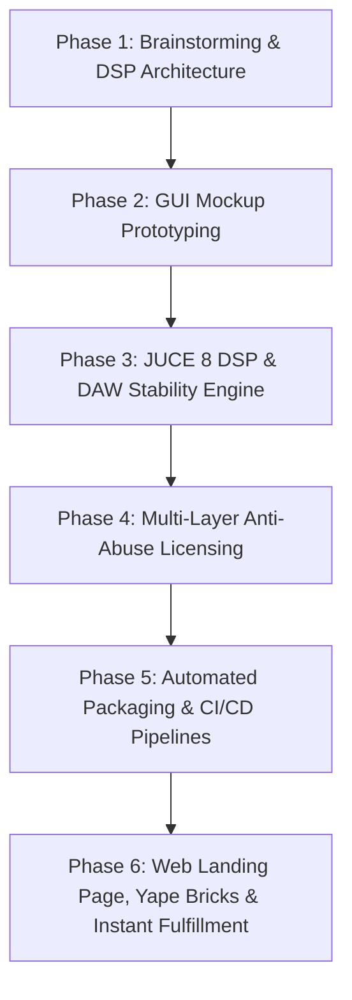
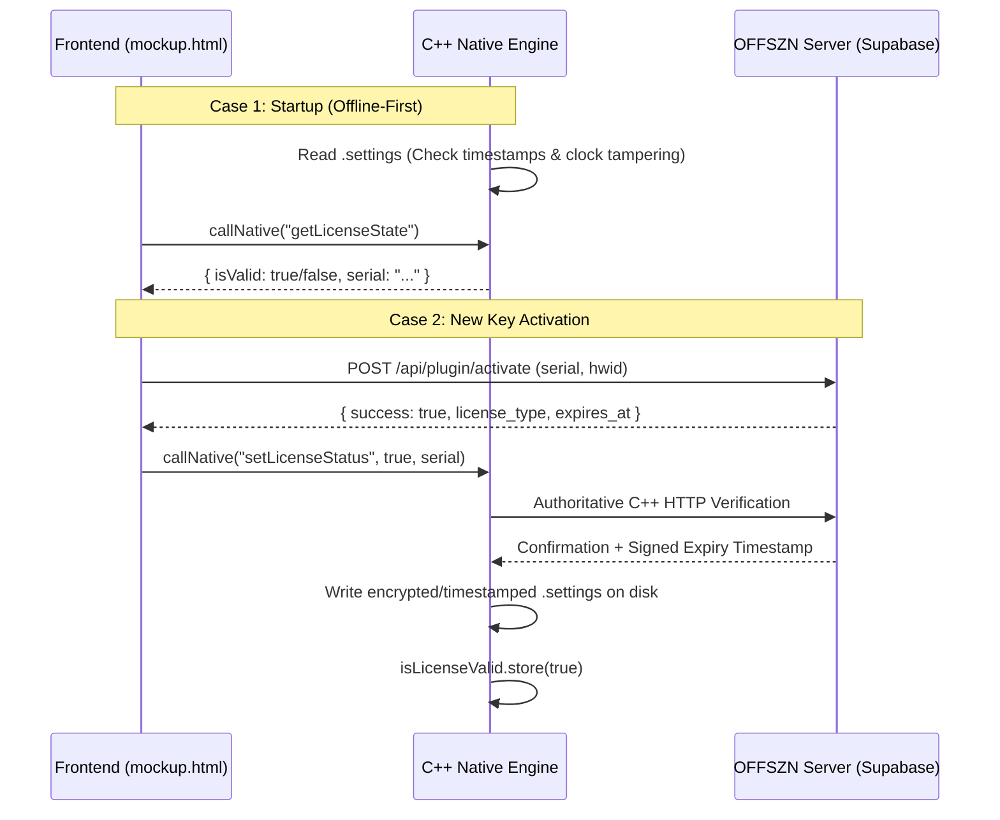
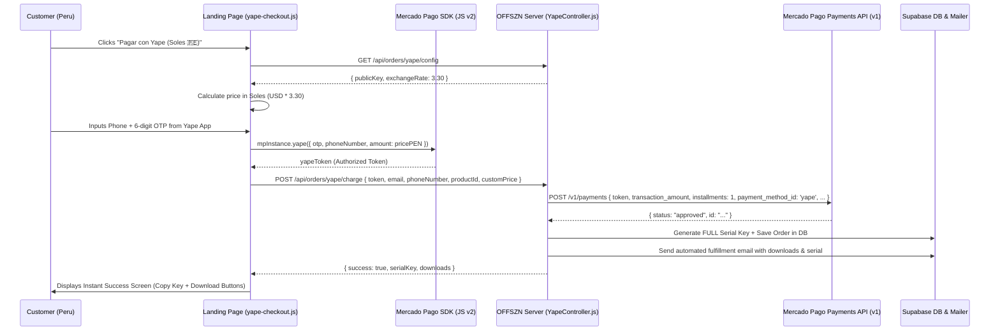

# OFFSZN JUCE VST3/AU Plugin Creator & Licensing Architecture

This skill defines the mandatory technical standards, anti-abuse security patterns, DAW stability rules, and development lifecycle for all OFFSZN VST3 and AudioUnit (AU) audio plugins across Windows and macOS.

---

## 🧭 End-to-End Plugin Lifecycle Workflow

When creating a new OFFSZN plugin or upgrading an existing one, always follow this structured 5-phase workflow:



---

## 🎨 Phase 1: Brainstorming & DSP Architecture Planning

Before writing C++ or HTML code, establish a clear technical design document:
1. **Target Audio Use-Case & Identity:**
   - Define plugin purpose (e.g., Vocal Chain, Mastering Limiter, Dynamic Analog Saturator, Multi-gap Audio Recorder).
   - Brand name, product code (`4 chars` unique, e.g., `Esym`, `Esma`), manufacturer code (`Ofsz`).
2. **DSP Parameter Blueprint:**
   - List all automatable parameters, default values, skew curves, and units (`dB`, `Hz`, `ms`, `%`).
3. **Licensing Tier:**
   - `Free / Gift Edition` (No serial required, full offline GUI customization).
   - `Commercial / Trial Edition` (Online activation + offline tamper-resistant `.settings` timestamps).

---

## 🖥️ Phase 2: Local GUI Architecture & Offline-First Design (`mockup.html`)

To guarantee zero latency on plugin launch and eliminate network dependency / WebView2 errors (Error 11 & Error 13):

1. **Local-First HTML Loading:** The plugin interface must always load from disk (`AppData/Roaming/OFFSZN/<PluginGuiFolder>/mockup.html` on Windows, or `Application Support/OFFSZN/<PluginGuiFolder>/mockup.html` on macOS).
2. **Trial Launch Protocol (DO NOT SPAM SERVER):**
   - **NEVER** call `fetch /api/plugin/activate` on every single plugin launch for trial users.
   - **The Golden Rule:** When the plugin opens, `callNative("getLicenseState")` asks C++ for the local validation status. If C++ reports `isValid == true`, the trial is active offline. Trust the C++ engine, calculate remaining days locally from the timestamp, and display the trial badge.
   - **Only trigger online fetch** during initial serial registration or when C++ explicitly flags `isValid == false`.

```javascript
// ✅ Correct Offline-First Startup Flow in mockup.html
callNative("getLicenseState").then(function (state) {
  var isValid = state && state.isValid;
  var serial = (state && state.serial || "").trim();

  if (serial) {
    var isTrial = serial.toUpperCase().indexOf("TRIAL-") !== -1;
    if (isTrial) {
      if (isValid) {
        // Active trial: trust C++ local timestamp validation completely
        var tokens = serial.split('|');
        var expiresUnix = tokens.length > 1 ? parseInt(tokens[1], 10) : 0;
        if (expiresUnix > 0) {
          var secondsLeft = expiresUnix - Math.floor(Date.now() / 1000);
          var daysLeft = Math.ceil(secondsLeft / 86400);
          showTrialBadge(daysLeft);
        }
      } else {
        // Expired or clock tamper detected locally by C++
        triggerLicenseExpired("Prueba Expirada", "Tu periodo de prueba ha expirado. Adquiere una licencia FULL en offszn.lat.");
      }
    } else {
      // FULL Key: 100% offline forever
      if (!isValid) openActivationModal(false);
    }
  } else {
    // No serial: ask for activation
    openActivationModal(false);
  }
});
```

---

## ⚡ Phase 3: JUCE 8 C++ DSP & DAW Crash-Prevention Standards

### 🛡️ Mandatory DAW Stability & Anti-Crash Rules (Windows & macOS)

| Problem Area | Root Cause in DAWs | Mandatory Code Implementation |
|---|---|---|
| **1. COM Threading in DAWs** | Ableton Live, Cubase, and Reaper open VST3 GUIs on non-COM threads. WebView2 throws unhandled memory exceptions and **closes the DAW immediately**. | Call `CoInitializeEx (nullptr, COINIT_APARTMENTTHREADED);` inside `#if JUCE_WINDOWS` at the top of the Editor constructor. |
| **2. Multi-Instance File Locking** | Multiple plugin instances sharing a single WebView2 cache directory collide on Chromium SQLite `.lock` files. | Pre-create a dedicated isolated directory: `AppData/Roaming/OFFSZN/<PluginName>WV2`. |
| **3. Use-After-Free Window Closes** | If a user opens and closes a plugin window rapidly while background threads or async calls are pending, accessing `this` crashes the DAW. | **Always** wrap `juce::MessageManager::callAsync` with `juce::Component::SafePointer<MyEditor> safeThis(this);` and check `if (safeThis == nullptr) return;`. |
| **4. Destructor Timer Execution** | 30Hz RMS timers firing during object destruction crash by emitting events to null WebViews. | Explicitly call `stopTimer(); webComponent = nullptr;` in the Editor destructor. |
| **5. Mono Track Bus Crash** | Rejecting Mono configurations in `isBusesLayoutSupported` crashes or prevents loading on mono vocal tracks in Cubase, Logic Pro, and Reaper. | Allow both `mono` and `stereo` if `mainOutput == mainInput`. |
| **6. Denormal Floats in DSP** | Infinite floating-point fractions in IIR filters or reverbs spike CPU to 100%. | Add `juce::ScopedNoDenormals noDenormals;` at the very beginning of `processBlock`. |

#### 1. Bulletproof `PluginEditor.cpp` Boilerplate
```cpp
#include "PluginProcessor.h"
#include "PluginEditor.h"

#if JUCE_WINDOWS
 #include <objbase.h>
#endif

MyAudioProcessorEditor::MyAudioProcessorEditor (MyAudioProcessor& p)
    : AudioProcessorEditor (&p), audioProcessor (p)
{
#if JUCE_WINDOWS
    // 1. Mandatory COM Initialization for Ableton Live / Cubase
    CoInitializeEx (nullptr, COINIT_APARTMENTTHREADED);

    // 2. Dedicated isolated WebView2 user data folder
    juce::File wv2Folder = juce::File::getSpecialLocation (juce::File::userApplicationDataDirectory)
                               .getChildFile ("OFFSZN")
                               .getChildFile ("<PluginName>WV2");
    wv2Folder.createDirectory();

    auto options = juce::WebBrowserComponent::Options{}
        .withBackend (juce::WebBrowserComponent::Options::Backend::webview2)
        .withNativeIntegrationEnabled()
        .withWinWebView2Options (
            juce::WebBrowserComponent::Options::WinWebView2{}
                .withUserDataFolder (wv2Folder)
                .withStatusBarDisabled()
                .withBuiltInErrorPageDisabled())
#else
    // macOS: WebKit / WKWebView is automatically the native default in JUCE 8
    auto options = juce::WebBrowserComponent::Options{}
        .withNativeIntegrationEnabled()
#endif
        .withNativeFunction ("setParam", [this] (const juce::Array<juce::var>& args, auto complete)
        {
            if (args.size() >= 2)
            {
                juce::String id = args[0].toString();
                float val = (float) args[1];

                // 3. SafePointer protection against Use-After-Free
                juce::Component::SafePointer<MyAudioProcessorEditor> safeThis (this);
                juce::MessageManager::callAsync ([safeThis, id, val]
                {
                    if (safeThis == nullptr) return;
                    safeThis->audioProcessor.setParamFromUI (id, val);
                });
            }
            complete (juce::var());
        });

    webComponent = std::make_unique<MyWebBrowser> (options);

    // Load Local GUI
    juce::File guiDir = juce::File::getSpecialLocation (juce::File::userApplicationDataDirectory)
                            .getChildFile ("OFFSZN").getChildFile ("<PluginName>Gui");
    juce::File guiFile = guiDir.getChildFile ("mockup.html");

    const juce::String url = guiFile.existsAsFile()
        ? "file:///" + guiFile.getFullPathName().replaceCharacter ('\\', '/')
        : "https://offszn.lat/plugins/<slug>?v=1";

    webComponent->goToURL (url);
    addAndMakeVisible (*webComponent);
    setSize (1000, 530);
    startTimerHz (30);
}

// 4. Clean Destructor
MyAudioProcessorEditor::~MyAudioProcessorEditor()
{
    stopTimer();
    webComponent = nullptr;
}
```

#### 2. Universal Bus Layout (`PluginProcessor.cpp`)
```cpp
#ifndef JucePlugin_PreferredChannelConfigurations
bool MyAudioProcessor::isBusesLayoutSupported (const BusesLayout& layouts) const
{
    // Allow Mono and Stereo tracks seamlessly
    if (layouts.getMainOutputChannelSet() != juce::AudioChannelSet::mono()
     && layouts.getMainOutputChannelSet() != juce::AudioChannelSet::stereo())
        return false;

    if (layouts.getMainOutputChannelSet() != layouts.getMainInputChannelSet())
        return false;

    return true;
}
#endif
```

---

## 🔒 Phase 4: Multi-Layer Anti-Abuse Licensing Architecture

**Security Philosophy:** Never trust client-side JavaScript. The C++ audio engine is the authoritative enforcement gate.

### 🛡️ Core Rules for OFFSZN Plugin Licensing:
1. **Mandatory First-Time Online Activation:**
   - Entering any new key in the UI **MUST** verify with the official server (`https://offszn.lat/api/plugin/activate`) with `{ serial_key, hwid, plugin_name }`.
   - If there is no internet during initial key entry, reject activation with `"Se requiere conexión a internet para la primera activación."`.
   - **DO NOT** allow arbitrary offline activation of raw unverified strings.
2. **Permanent Offline Execution Once Activated (FULL & TRIAL):**
   - Once confirmed by the server, the cryptographically bound serial and timestamps are written to `%APPDATA%\OFFSZN\<Plugin>.settings`.
   - On all subsequent launches, C++ reads and validates `.settings` locally without making any network requests.
3. **Anti-Tamper & Clock Rewind Detection:**
   - If user rolls back system clock by more than 1 hour (`now < lastCheck - 3600`), C++ immediately flags tampering and revokes the license.
4. **Installer Non-Destructive Protection:**
   - Inno Setup and macOS pkg installers **MUST NEVER** overwrite or delete existing `.settings` or trial records.
5. **Authoritative DSP Audio Gate:**
   - If `!isLicenseValid.load()`, the C++ engine executes `buffer.clear(); return;`, enforcing complete audio silence/bypass.
6. **Universal Top-Right Badge & Modal Behavior:**
   - Badge displays in top-right: `PRUEBA · X DÍAS` (amber pulse), `FULL · OFFSZN` (green dot), or `DEMO · ACTIVAR` (red dot).
   - When an active license/trial is running, clicking the badge opens the activation modal with a visible **✕ (Close Button)** and Escape/backdrop click support.
   - When unlicensed/expired, the modal is hard-locked without a close button until a valid key is activated.
7. **HTML / WebView2 Zoom & Drag Lockdown:**
   - All plugin HTML must have `user-select: none`, `-webkit-user-drag: none`, fixed width/height, and prevent Ctrl+wheel / gesture zooming.



### 1. Offline Anti-Tamper & Clock Rewind Verification (`PluginProcessor.cpp`)
```cpp
if (settingsFile.existsAsFile())
{
    juce::String content = settingsFile.loadFileAsString().trim();
    if (content.startsWith ("<PREFIX>-FULL-"))
    {
        isLicenseValid.store (true); // Lifetime license: permanent offline access
    }
    else if (content.startsWith ("<PREFIX>-TRIAL-"))
    {
        auto tokens         = juce::StringArray::fromTokens (content, "|", "");
        juce::String serial = tokens.size() > 0 ? tokens[0] : content;
        int64_t expiresAt   = tokens.size() > 1 ? tokens[1].getLargeIntValue() : 0;
        int64_t lastCheck   = tokens.size() > 2 ? tokens[2].getLargeIntValue() : 0;
        int64_t now         = juce::Time::currentTimeMillis() / 1000;

        if (expiresAt > 0 && now >= expiresAt)
        {
            isLicenseValid.store (false); // Expired trial: bypass/lock
        }
        else if (lastCheck > 0 && now < (lastCheck - 3600))
        {
            // Clock tampering detected (user rolled back PC system clock)
            isLicenseValid.store (false);
        }
        else
        {
            isLicenseValid.store (true); // Valid trial: update last-seen timestamp
            if (expiresAt > 0)
                settingsFile.replaceWithText (serial + "|" + juce::String (expiresAt) + "|" + juce::String (now));
        }
    }
}
```

### 2. Audio Processing Bypass Enforcement
```cpp
void MyAudioProcessor::processBlock (juce::AudioBuffer<float>& buffer, juce::MidiBuffer&)
{
    juce::ScopedNoDenormals noDenormals;

    // Clear extra output channels
    for (auto i = getTotalNumInputChannels(); i < getTotalNumOutputChannels(); ++i)
        buffer.clear (i, 0, buffer.getNumSamples());

    // If license is invalid, cleanly bypass audio without processing
    if (!isLicenseValid.load())
        return;

    // ... Real-time DSP Processing ...
}
```

---

## 📦 Phase 5: Packaging, Inno Setup & macOS CI/CD Standards

### 🪟 Windows Installer Standard (`<PLUGIN>.iss`)
- **Flags:** Use `replacesameversion uninsneveruninstall` for `mockup.html` to guarantee GUI updates on reinstall without erasing user settings.
- **Dependency Checks:** Auto-detect and silently install **Microsoft Visual C++ 2015-2022 x64** and **Microsoft Edge WebView2 Runtime**.
- **Anti-Nesting Cleanup:** Purge legacy nested folders (`PLUGIN.vst3\PLUGIN.vst3`) during install step to eliminate duplicate `PLUGIN_2` DAW entries.

```ini
[Setup]
AppId={{UNIQUE-GUID-HERE}}
AppName=OFFSZN <PLUGIN_NAME> VST3
AppVersion=2.0.1
AppPublisher=OFFSZN
AppPublisherURL=https://offszn.lat
DefaultDirName={commoncf}\VST3
DefaultGroupName=OFFSZN
DisableProgramGroupPage=yes
OutputBaseFilename=OFFSZN_<PLUGIN_NAME>_Setup
OutputDir=.\Output
Compression=lzma2/ultra64
SolidCompression=yes
ArchitecturesInstallIn64BitMode=x64compatible
ArchitecturesAllowed=x64compatible
PrivilegesRequired=admin
WizardStyle=modern

[Files]
Source: "build\<TARGET>_artefacts\Release\VST3\<PLUGIN_NAME>.vst3\*"; DestDir: "{commoncf}\VST3\<PLUGIN_NAME>.vst3"; Flags: ignoreversion recursesubdirs createallsubdirs
Source: "mockup.html"; DestDir: "{userappdata}\OFFSZN\<PluginGuiFolder>"; DestName: "mockup.html"; Flags: replacesameversion uninsneveruninstall

[Code]
procedure CurStepChanged(CurStep: TSetupStep);
begin
  if CurStep = ssInstall then
  begin
    DelTree(ExpandConstant('{commoncf}\VST3\<PLUGIN_NAME>.vst3\<PLUGIN_NAME>.vst3'), True, True, True);
  end;
end;
```

---

### 🍏 macOS GitHub Actions Automated CI/CD (`build_mac.yml`)
- **Generator:** Always use `-G "Xcode"` with `-DCMAKE_OSX_DEPLOYMENT_TARGET="11.0"` on `macos-14` (Apple Silicon).
- **Formats:** Compile both **VST3** and **AU (.component)** formats.
- **Packaging:** Combine into an Apple installer `.pkg` via `pkgbuild` and `productbuild` with universal support (`arm64` + `x86_64`).

---

## 💳 Phase 6: Web Landing Page, Yape Bricks & Instant Fulfillment Architecture

When publishing a new OFFSZN plugin or building its sales landing page, integrating the **Yape (Mercado Pago Perú)** instant checkout is mandatory alongside PayPal.



### 🛡️ Mandatory Technical Rules for Yape Checkout:

#### 1. Frontend Landing Page Integration (`plugins/<plugin-slug>.html`)
- **Trigger Button:** Use the standardized high-contrast `.btn-yape-white` button directly beneath PayPal/Mercado Pago.
```html
<!-- Botón Yape (Modal Instantáneo Mercado Pago Perú) -->
<button type="button" data-action="open-yape-checkout" id="btn-yape-checkout" class="btn-yape-white">
    
    Pagar con Yape (Soles 🇵🇪)
</button>
```
- **Scripts at Closing `</body>`:**
```html
<script src="https://sdk.mercadopago.com/js/v2"></script>
<script src="/script/plugin-checkout.js?v=2"></script>
<script src="/script/yape-checkout.js?v=7"></script>
```
- **Mandatory Window Globals (Dynamic Pricing):**
```javascript
// Expose plugin metadata and dynamic A/B promo price to window
window.PLUGIN_ID = 904; // Unique numeric ID
window.PLUGIN_NAME = 'Plugin Name';
window.CURRENT_PROMO_PRICE = assignedPrice; // Dynamic USD price ($5, $10, $15, $20)
```

#### 2. Mercado Pago JS SDK Tokenization Rule (`yape-checkout.js`)
- **⚠️ CRITICAL GOTCHA (`amount` parameter):** When calling `mpInstance.yape()`, you **MUST** pass `amount: pricePEN`. If omitted, the SDK creates an unbacked 0-amount token, causing Mercado Pago to return `Invalid value for transaction_amount`.
```javascript
// ✅ Correct Token Creation with Amount
const pricePEN = parseFloat(this.getPricePEN());
const yape = this.mpInstance.yape({
    otp: otp,
    phoneNumber: phone,
    amount: pricePEN // <-- MANDATORY
});
const tokenObj = await yape.create();
const yapeToken = (typeof tokenObj === 'string') ? tokenObj : (tokenObj?.id || tokenObj?.token || tokenObj);
```
- **OTP Input UX:** Modal must use 6 isolated digit boxes (`[ ] [ ] [ ] [ ] [ ] [ ]`) with auto-advance, backspace navigation, paste support, and clean black & white aesthetic (no distracting heavy glows).

#### 3. Backend Controller Standard (`server/src/infrastructure/http/controllers/YapeController.js`)
- **Plugin Catalog Mapping:** Every new plugin must be registered in `PLUGIN_INFO_MAP`:
```javascript
'<NEW_ID>': {
    name: '<Plugin Name>',
    downloads: {
        win: 'https://drive.google.com/... or /installer_output/...Setup.exe',
        mac: 'https://drive.google.com/... or /downloads/...pkg'
    }
}
```
- **Mercado Pago `/v1/payments` Mandatory Payload Constraints:**
```javascript
const mpPayload = {
    token: token,
    transaction_amount: amountPEN, // Must be >= S/. 3.00 (MP Peru minimum)
    installments: 1,               // ⚠️ MANDATORY: Failing to send installments: 1 causes 'Invalid installments'
    description: `OFFSZN - ${pluginName} VST (Licencia Vitalicia)`,
    payment_method_id: 'yape',     // ⚠️ MANDATORY
    payer: {
        email: email.trim().toLowerCase()
    },
    metadata: {
        product_id: parseInt(productId, 10),
        plugin_name: pluginName,
        usd_price: validUsdPrice,
        exchange_rate: exchangeRate,
        phone_number: phoneNumber || null
    }
};
```
- **Dynamic Currency Calculation:**
```javascript
const exchangeRate = parseFloat(process.env.YAPE_EXCHANGE_RATE_PEN) || 3.30;
const validUsdPrice = parseFloat(customPrice) || 10;
const amountPEN = req.body.customPricePEN 
    ? Number(parseFloat(req.body.customPricePEN).toFixed(2)) 
    : Number((validUsdPrice * exchangeRate).toFixed(2));
```

#### 4. Content Security Policy (CSP) Directives (`server/src/app.js`)
- Ensure Helmet CSP allows Mercado Pago and Mercado Libre telemetry to prevent console blocks:
  - `connectSrc`: `https://*.mercadopago.com`, `https://*.mercadopago.com.pe`, `https://events.mercadopago.com`, `https://api.mercadolibre.com`, `https://*.mercadolibre.com`, `https://*.mercadolibre.com.pe`
  - `frameSrc`: `https://*.mercadopago.com`, `https://*.mercadopago.com.pe`, `https://*.mercadolibre.com`
  - `imgSrc`: `https://*.mercadopago.com`, `https://*.mercadopago.com.pe`, `https://*.mercadolibre.com`, `https://*.mercadolivre.com`

#### 5. Instant Customer Fulfillment & Licensing
- Upon payment verification (`status === 'approved'`):
  1. Generate 1 official `FULL` lifetime license key (`generatePluginLicense({ email, productId, pluginName, licenseType: 'FULL' })`).
  2. Record transaction in Supabase with payment method `yape` and Mercado Pago transaction ID.
  3. Send 1 consolidated delivery email to customer with Serial Key and installer download links.
  4. Dispatch Meta CAPI Purchase event for ad optimization.

