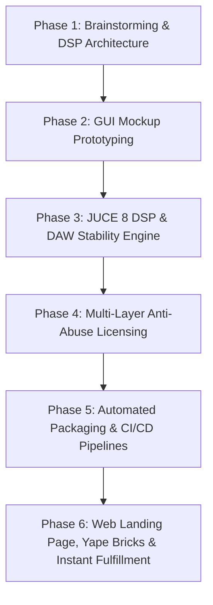
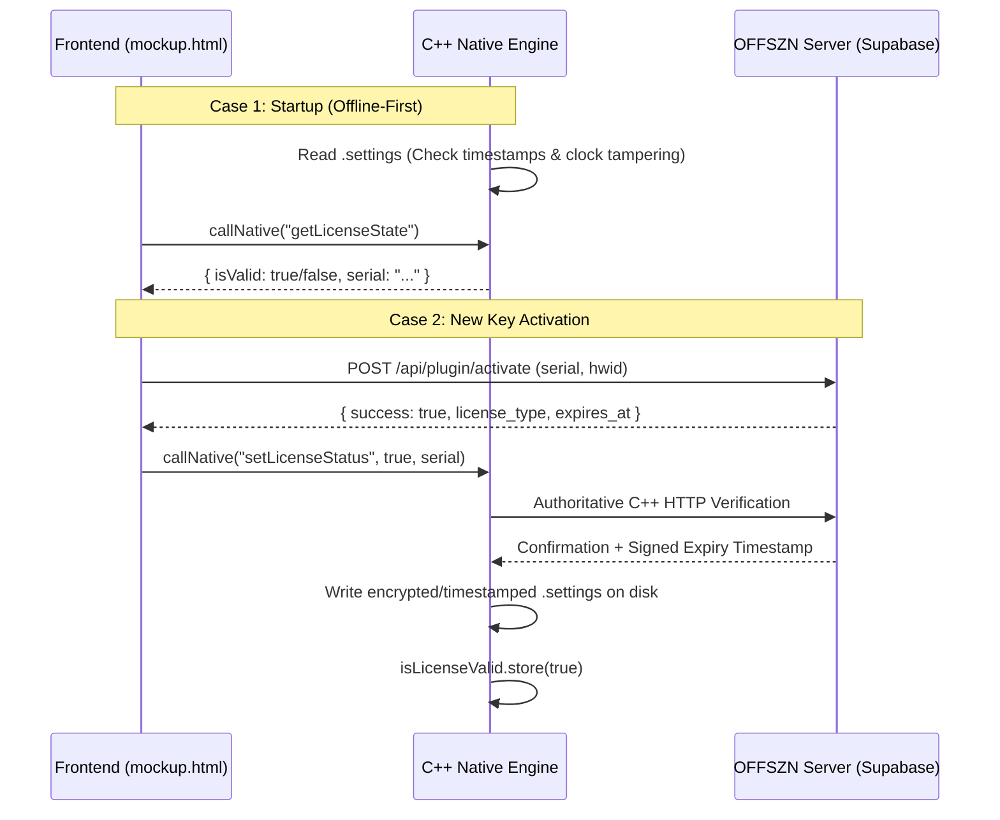

# OFFSZN JUCE VST3/AU Plugin Creator & Licensing Architecture

This skill defines the mandatory technical standards, anti-abuse security patterns, DAW stability rules, and development lifecycle for all OFFSZN VST3 and AudioUnit (AU) audio plugins across Windows and macOS.

---

## 🧭 End-to-End Plugin Lifecycle Workflow

When creating a new OFFSZN plugin or upgrading an existing one, always follow this structured 5-phase workflow:



---

## 🎨 Phase 1: Brainstorming & DSP Architecture Planning

Before writing C++ or HTML code, establish a clear technical design document:
1. **Target Audio Use-Case & Identity:**
   - Define plugin purpose (e.g., Vocal Chain, Mastering Limiter, Dynamic Analog Saturator, Multi-gap Audio Recorder).
   - Brand name, product code (`4 chars` unique, e.g., `Esym`, `Esma`), manufacturer code (`Ofsz`).
2. **DSP Parameter Blueprint:**
   - List all automatable parameters, default values, skew curves, and units (`dB`, `Hz`, `ms`, `%`).
3. **Licensing Tier:**
   - `Free / Gift Edition` (No serial required, full offline GUI customization).
   - `Commercial / Trial Edition` (Online activation + offline tamper-resistant `.settings` timestamps).

---

## 🖥️ Phase 2: Local GUI Architecture & Offline-First Design (`mockup.html`)

To guarantee zero latency on plugin launch and eliminate network dependency / WebView2 errors (Error 11 & Error 13):

1. **Local-First HTML Loading:** The plugin interface must always load from disk (`AppData/Roaming/OFFSZN/<PluginGuiFolder>/mockup.html` on Windows, or `Application Support/OFFSZN/<PluginGuiFolder>/mockup.html` on macOS).
2. **Trial Launch Protocol (DO NOT SPAM SERVER):**
   - **NEVER** call `fetch /api/plugin/activate` on every single plugin launch for trial users.
   - **The Golden Rule:** When the plugin opens, `callNative("getLicenseState")` asks C++ for the local validation status. If C++ reports `isValid == true`, the trial is active offline. Trust the C++ engine, calculate remaining days locally from the timestamp, and display the trial badge.
   - **Only trigger online fetch** during initial serial registration or when C++ explicitly flags `isValid == false`.

```javascript
// ✅ Correct Offline-First Startup Flow in mockup.html
callNative("getLicenseState").then(function (state) {
  var isValid = state && state.isValid;
  var rawSerial = (state && state.serial || "").trim();

  if (rawSerial) {
    var isTrial = rawSerial.toUpperCase().indexOf("TRIAL-") !== -1;
    if (isTrial) {
      if (isValid) {
        // 1. Active trial: trust C++ local timestamp validation completely (zero network lock)
        try { localStorage.setItem('offszn_serial', rawSerial); } catch (e) { }

        // 2. Parse timestamps: FORMAT = SERIAL|EXPIRES_UNIX|LAST_CHECK_UNIX
        var tokens = rawSerial.split('|');
        var trialSerial = tokens[0];
        var expiresUnix = tokens.length > 1 ? parseInt(tokens[1], 10) : 0;
        if (expiresUnix > 0) {
          var secondsLeft = expiresUnix - Math.floor(Date.now() / 1000);
          var daysLeft = Math.ceil(secondsLeft / 86400);
          updateTrialBadge(true, daysLeft > 1 ? (daysLeft + " DÍAS") : (daysLeft === 1 ? "1 DÍA" : "ÚLTIMO DÍA"));
        } else {
          updateTrialBadge(true, "3 DÍAS");
        }

        // 3. Silent background check ONLY if online (NEVER blocks audio or UI if offline)
        getHwidAsync().then(function (hwid) {
          var effectiveHwid = hwid || getOrCreateDeviceId();
          fetch(apiBase + "/api/plugin/activate", {
            method: "POST",
            headers: { "Content-Type": "application/json" },
            body: JSON.stringify({ serial_key: trialSerial, hwid: effectiveHwid, plugin_name: "<Plugin Name>" })
          }).then(function (res) { return res.json(); }).then(function (response) {
            if (response && !response.success) {
              console.warn("[Trial] Serial revoked or expired by server:", response);
              triggerLicenseExpired("Prueba Expirada", response.error || "Tu periodo de prueba ha expirado.");
            }
          }).catch(function (err) {
            console.log("[Trial] Server unreachable / offline — continuing with local validation:", err);
          });
        });
      } else {
        // Expired or clock tamper detected locally by C++
        triggerLicenseExpired("Prueba Expirada", "Tu periodo de prueba ha expirado. Adquiere una licencia FULL en offszn.lat.");
      }
    } else {
      // FULL Key: 100% offline forever, zero network requests
      if (isValid) {
        try { localStorage.setItem('offszn_serial', rawSerial); } catch (e) { }
        updateTrialBadge(false);
      } else {
        callNative("setLicenseStatus", false);
        openActivationModal(false);
      }
    }
  } else {
    // No serial: prompt activation
    callNative("setLicenseStatus", false);
    openActivationModal(false);
  }
});
```

---

## ⚡ Phase 3: JUCE 8 C++ DSP & DAW Crash-Prevention Standards

### 🛡️ Mandatory DAW Stability & Anti-Crash Rules (Windows & macOS)

| Problem Area | Root Cause in DAWs | Mandatory Code Implementation |
|---|---|---|
| **1. COM Threading in DAWs** | Ableton Live, Cubase, and Reaper open VST3 GUIs on non-COM threads. WebView2 throws unhandled memory exceptions and **closes the DAW immediately**. | Call `CoInitializeEx (nullptr, COINIT_APARTMENTTHREADED);` inside `#if JUCE_WINDOWS` at the top of the Editor constructor. |
| **2. Multi-Instance File Locking** | Multiple plugin instances sharing a single WebView2 cache directory collide on Chromium SQLite `.lock` files. | Pre-create a dedicated isolated directory: `AppData/Roaming/OFFSZN/<PluginName>WV2`. |
| **3. Use-After-Free Window Closes** | If a user opens and closes a plugin window rapidly while background threads or async calls are pending, accessing `this` crashes the DAW. | **Always** wrap `juce::MessageManager::callAsync` with `juce::Component::SafePointer<MyEditor> safeThis(this);` and check `if (safeThis == nullptr) return;`. |
| **4. Destructor Timer Execution** | 30Hz RMS timers firing during object destruction crash by emitting events to null WebViews. | Explicitly call `stopTimer(); webComponent = nullptr;` in the Editor destructor. |
| **5. Mono Track Bus Crash** | Rejecting Mono configurations in `isBusesLayoutSupported` crashes or prevents loading on mono vocal tracks in Cubase, Logic Pro, and Reaper. | Allow both `mono` and `stereo` if `mainOutput == mainInput`. |
| **6. Denormal Floats in DSP** | Infinite floating-point fractions in IIR filters or reverbs spike CPU to 100%. | Add `juce::ScopedNoDenormals noDenormals;` at the very beginning of `processBlock`. |

#### 1. Bulletproof `PluginEditor.cpp` Boilerplate
```cpp
#include "PluginProcessor.h"
#include "PluginEditor.h"

#if JUCE_WINDOWS
 #include <objbase.h>
#endif

MyAudioProcessorEditor::MyAudioProcessorEditor (MyAudioProcessor& p)
    : AudioProcessorEditor (&p), audioProcessor (p)
{
#if JUCE_WINDOWS
    // 1. Mandatory COM Initialization for Ableton Live / Cubase
    CoInitializeEx (nullptr, COINIT_APARTMENTTHREADED);

    // 2. Dedicated isolated WebView2 user data folder
    juce::File wv2Folder = juce::File::getSpecialLocation (juce::File::userApplicationDataDirectory)
                               .getChildFile ("OFFSZN")
                               .getChildFile ("<PluginName>WV2");
    wv2Folder.createDirectory();

    auto options = juce::WebBrowserComponent::Options{}
        .withBackend (juce::WebBrowserComponent::Options::Backend::webview2)
        .withNativeIntegrationEnabled()
        .withWinWebView2Options (
            juce::WebBrowserComponent::Options::WinWebView2{}
                .withUserDataFolder (wv2Folder)
                .withStatusBarDisabled()
                .withBuiltInErrorPageDisabled())
#else
    // macOS: WebKit / WKWebView is automatically the native default in JUCE 8
    auto options = juce::WebBrowserComponent::Options{}
        .withNativeIntegrationEnabled()
#endif
        .withNativeFunction ("setParam", [this] (const juce::Array<juce::var>& args, auto complete)
        {
            if (args.size() >= 2)
            {
                juce::String id = args[0].toString();
                float val = (float) args[1];

                // 3. SafePointer protection against Use-After-Free
                juce::Component::SafePointer<MyAudioProcessorEditor> safeThis (this);
                juce::MessageManager::callAsync ([safeThis, id, val]
                {
                    if (safeThis == nullptr) return;
                    safeThis->audioProcessor.setParamFromUI (id, val);
                });
            }
            complete (juce::var());
        });

    webComponent = std::make_unique<MyWebBrowser> (options);

    // Load Local GUI
    juce::File guiDir = juce::File::getSpecialLocation (juce::File::userApplicationDataDirectory)
                            .getChildFile ("OFFSZN").getChildFile ("<PluginName>Gui");
    juce::File guiFile = guiDir.getChildFile ("mockup.html");

    const juce::String url = guiFile.existsAsFile()
        ? "file:///" + guiFile.getFullPathName().replaceCharacter ('\\', '/')
        : "https://offszn.lat/plugins/<slug>?v=1";

    webComponent->goToURL (url);
    addAndMakeVisible (*webComponent);
    setSize (1000, 530);
    startTimerHz (30);
}

// 4. Clean Destructor
MyAudioProcessorEditor::~MyAudioProcessorEditor()
{
    stopTimer();
    webComponent = nullptr;
}
```

#### 2. Universal Bus Layout (`PluginProcessor.cpp`)
```cpp
#ifndef JucePlugin_PreferredChannelConfigurations
bool MyAudioProcessor::isBusesLayoutSupported (const BusesLayout& layouts) const
{
    // Allow Mono and Stereo tracks seamlessly
    if (layouts.getMainOutputChannelSet() != juce::AudioChannelSet::mono()
     && layouts.getMainOutputChannelSet() != juce::AudioChannelSet::stereo())
        return false;

    if (layouts.getMainOutputChannelSet() != layouts.getMainInputChannelSet())
        return false;

    return true;
}
#endif
```

---

## 🔒 Phase 4: Multi-Layer Anti-Abuse Licensing Architecture

**Security Philosophy:** Never trust client-side JavaScript. The C++ audio engine is the authoritative enforcement gate.

### 🛡️ Core Rules for OFFSZN Plugin Licensing:
1. **Mandatory First-Time Online Activation:**
   - Entering any new key in the UI **MUST** verify with the official server (`https://offszn.lat/api/plugin/activate`) with `{ serial_key, hwid, plugin_name }`.
   - If there is no internet during initial key entry, reject activation with `"Se requiere conexión a internet para la primera activación."`.
   - **DO NOT** allow arbitrary offline activation of raw unverified strings.
2. **Permanent Offline Execution Once Activated (FULL & TRIAL):**
   - Once confirmed by the server, the cryptographically bound serial and timestamps are written to `%APPDATA%\OFFSZN\<Plugin>.settings`.
   - On all subsequent launches, C++ reads and validates `.settings` locally without making any network requests.
3. **Anti-Tamper & Clock Rewind Detection:**
   - If user rolls back system clock by more than 1 hour (`now < lastCheck - 3600`), C++ immediately flags tampering and revokes the license.
4. **Installer Non-Destructive Protection:**
   - Inno Setup and macOS pkg installers **MUST NEVER** overwrite or delete existing `.settings` or trial records.
5. **Authoritative DSP Audio Gate:**
   - If `!isLicenseValid.load()`, the C++ engine executes `buffer.clear(); return;`, enforcing complete audio silence/bypass.
6. **Universal Top-Right Badge & Modal Behavior:**
   - Badge displays in top-right: `PRUEBA · X DÍAS` (amber pulse), `FULL · OFFSZN` (green dot), or `DEMO · ACTIVAR` (red dot).
   - When an active license/trial is running, clicking the badge opens the activation modal with a visible **✕ (Close Button)** and Escape/backdrop click support.
   - When unlicensed/expired, the modal is hard-locked without a close button until a valid key is activated.
7. **HTML / WebView2 Zoom & Drag Lockdown:**
   - All plugin HTML must have `user-select: none`, `-webkit-user-drag: none`, fixed width/height, and prevent Ctrl+wheel / gesture zooming.



### 1. Offline Anti-Tamper & Clock Rewind Verification (`PluginProcessor.cpp`)
```cpp
if (settingsFile.existsAsFile())
{
    juce::String content = settingsFile.loadFileAsString().trim();
    if (content.startsWith ("<PREFIX>-FULL-"))
    {
        isLicenseValid.store (true); // Lifetime license: permanent offline access
    }
    else if (content.startsWith ("<PREFIX>-TRIAL-"))
    {
        auto tokens         = juce::StringArray::fromTokens (content, "|", "");
        juce::String serial = tokens.size() > 0 ? tokens[0] : content;
        int64_t expiresAt   = tokens.size() > 1 ? tokens[1].getLargeIntValue() : 0;
        int64_t lastCheck   = tokens.size() > 2 ? tokens[2].getLargeIntValue() : 0;
        int64_t now         = juce::Time::currentTimeMillis() / 1000;

        if (expiresAt > 0 && now >= expiresAt)
        {
            isLicenseValid.store (false); // Expired trial: bypass/lock
        }
        else if (lastCheck > 0 && now < (lastCheck - 3600))
        {
            // Clock tampering detected (user rolled back PC system clock)
            isLicenseValid.store (false);
        }
        else
        {
            isLicenseValid.store (true); // Valid trial: update last-seen timestamp
            if (expiresAt > 0)
                settingsFile.replaceWithText (serial + "|" + juce::String (expiresAt) + "|" + juce::String (now));
        }
    }
}
```

### 2. Audio Processing Bypass Enforcement
```cpp
void MyAudioProcessor::processBlock (juce::AudioBuffer<float>& buffer, juce::MidiBuffer&)
{
    juce::ScopedNoDenormals noDenormals;

    // Clear extra output channels
    for (auto i = getTotalNumInputChannels(); i < getTotalNumOutputChannels(); ++i)
        buffer.clear (i, 0, buffer.getNumSamples());

    // If license is invalid, cleanly bypass audio without processing
    if (!isLicenseValid.load())
        return;

    // ... Real-time DSP Processing ...
}
```

---

## 📦 Phase 5: Packaging, Inno Setup & macOS CI/CD Standards

### 🪟 Windows Installer Standard (`<PLUGIN>.iss`)

> [!CAUTION]
> **CRITICAL: `DefaultDirName` MUST point to `{autopf}\OFFSZN\<Plugin Name>`**, NOT to `{commoncf}\VST3\<PLUGIN>.vst3`.  
> Using the VST3 bundle folder as `DefaultDirName` causes Inno Setup to write `unins000.exe` and `unins000.dat` **inside the `.vst3` bundle**, which makes DAWs (FL Studio, Ableton, Reaper, Cubase) detect invalid files during plugin scan → **Error 11 / scan failure**.

- **Flags:** Use `replacesameversion uninsneveruninstall` for `mockup.html` to guarantee GUI updates on reinstall without erasing user settings.
- **VST3 DestDir:** Always set `DestDir: "{commoncf}\VST3\<PLUGIN_NAME>.vst3"` in `[Files]`, never use `{app}` for the VST3 binary.
- **Anti-Nesting + Uninstaller Cleanup:** The `[Code]` block must:
  1. Delete `unins000.exe/.dat` left inside the bundle by older installers.
  2. Delete nested duplicate folder `PLUGIN.vst3\PLUGIN.vst3`.
  3. Delete legacy folders with spaces (`PLUGIN NAME.vst3`).

```ini
[Setup]
AppId={{UNIQUE-GUID-HERE}}
AppName=OFFSZN <PLUGIN_NAME> VST3
AppVersion=X.X.X
AppPublisher=OFFSZN
AppPublisherURL=https://offszn.lat

; ⚠️ CRITICAL: Uninstaller (unins000.exe) lives HERE, NOT inside the .vst3 bundle
DefaultDirName={autopf}\OFFSZN\<PLUGIN DISPLAY NAME>
DefaultGroupName=OFFSZN
DisableProgramGroupPage=yes
DisableDirPage=yes
DirExistsWarning=no
DisableWelcomePage=no
OutputBaseFilename=OFFSZN_<PLUGIN_NAME>_Setup
OutputDir=.\Output
Compression=lzma2/ultra64
SolidCompression=yes
ArchitecturesInstallIn64BitMode=x64compatible
ArchitecturesAllowed=x64compatible
PrivilegesRequired=admin
WizardStyle=modern
UninstallDisplayName=OFFSZN <PLUGIN_NAME> VST3

[Languages]
Name: "spanish"; MessagesFile: "compiler:Languages\Spanish.isl"

[Files]
; VST3 binary goes to Common Files\VST3 via DestDir (NOT via {app})
Source: "build\<TARGET>_artefacts\Release\VST3\<PLUGIN_NAME>.vst3\*"; \
    DestDir: "{commoncf}\VST3\<PLUGIN_NAME>.vst3"; \
    Flags: ignoreversion recursesubdirs createallsubdirs

; GUI HTML: always updated on reinstall, preserved on uninstall
Source: "mockup.html"; \
    DestDir: "{userappdata}\OFFSZN\<PluginGuiFolder>"; \
    DestName: "mockup.html"; \
    Flags: replacesameversion uninsneveruninstall

[Code]
procedure CurStepChanged(CurStep: TSetupStep);
var
  bundlePath: String;
begin
  if CurStep = ssInstall then
  begin
    bundlePath := ExpandConstant('{commoncf}\VST3\<PLUGIN_NAME>.vst3');

    // Fix: remove uninstaller files left INSIDE the bundle by older installers
    // (these cause Error 11 / scan failure in FL Studio, Ableton, Reaper, Cubase)
    DeleteFile(bundlePath + '\unins000.exe');
    DeleteFile(bundlePath + '\unins000.dat');
    DeleteFile(bundlePath + '\unins001.exe');
    DeleteFile(bundlePath + '\unins001.dat');

    // Anti-nesting: remove duplicate nested bundle from old installers
    DelTree(bundlePath + '\<PLUGIN_NAME>.vst3', True, True, True);

    // Legacy name cleanup (if plugin was previously installed with spaces)
    DelTree(ExpandConstant('{commoncf}\VST3\<PLUGIN DISPLAY NAME>.vst3'), True, True, True);
  end;
end;

function InitializeSetup(): Boolean;
begin
  MsgBox(
    'Antes de continuar, cierra completamente:' + #13#10 +
    '  - FL Studio' + #13#10 +
    '  - Ableton Live' + #13#10 +
    '  - Reaper, Cubase u otro DAW' + #13#10 + #13#10 +
    'El instalador necesita acceso exclusivo a los archivos del plugin.',
    mbInformation, MB_OK);
  Result := True;
end;

[UninstallDelete]
Type: filesandordirs; Name: "{commoncf}\VST3\<PLUGIN_NAME>.vst3"
```

---

### 🍏 macOS GitHub Actions Automated CI/CD (`build_mac.yml`)
- **Generator:** Always use `-G "Xcode"` with `-DCMAKE_OSX_DEPLOYMENT_TARGET="11.0"` on `macos-14` (Apple Silicon).
- **Formats:** Compile both **VST3** and **AU (.component)** formats.
- **Packaging:** Combine into an Apple installer `.pkg` via `pkgbuild` and `productbuild` with universal support (`arm64` + `x86_64`).

---

## 🌐 Phase 6: High-Converting Plugin Landing Page Design System & Checkout Architecture

When publishing a new OFFSZN plugin or building its sales/trial landing pages, always adhere to the following **High-Converting Design System** and **Instant Fulfillment Pipeline**.

### 🔄 The Dual Landing Page Strategy
Every OFFSZN plugin uses a two-tier landing page system:
1. **Public Showcase Landing (`/plugins/<plugin-slug>.html`):** The organic exploration page. Includes free trial/demo download modals, tutorial video, full feature deep-dives, technical specifications, and the lifetime purchase CTA at the bottom.
2. **Direct Sales & Ads Landing (`/plugin/<plugin-slug>.html`):** The high-velocity conversion page for ad traffic (Meta, TikTok, Google Ads). Eliminates friction, anchors immediately to `#pricing-section`, features dynamic A/B promo pricing ($5, $10, $15, $20), and triggers instant checkout modals (Yape, PayPal, Mercado Pago, Binance).

> **Universal Rule:** Both landing pages **MUST** share the identical state-of-the-art visual design, Hero layout, pure white high-contrast CTA buttons, smart floating navbar, interactive audio comparison ("Antes vs Después"), continuous 2-row testimonials marquee, and unified philosophy banner.

---

### 🎨 Part A: Premium Landing Page Design System & Architecture

All OFFSZN plugin landings must look state-of-the-art, high-tech, and extremely polished. Never produce flat, generic, or empty MVPs.

```mermaid
graph TD
    A[Top Announcement Bar (Fixed at top: 0)] --> B[Hero Section (Ambient Mesh BG + White CTA + Glowing Mockup)]
    B --> C[Fixed Glassmorphic Navbar (Auto-shows on scroll, Auto-hides on #pricing-section)]
    C --> D[Interactive Audio Comparison (Antes vs Después + Lazy WaveSurfer.js)]
    D --> E[DAW & OS Compatibility Grid (FL Studio, Ableton, Logic, Mac/Win)]
    E --> F[2-Row Infinite Marquee Testimonials (Continuous loop, hover pause, Lightbox)]
    F --> G[Double-Column Pricing Section (Desktop: checks left + card right | Mobile: card first)]
    G --> H[Interactive FAQ Accordion]
    H --> I[Unified Tagline CTA + Philosophy Statement Banner]
```

#### 1. Core Visual Identity & High-Contrast White CTA Standards
- **Background:** Deep rich black (`#0a0a0a` to `#000000`).
- **Typography:** Google Font **Geist** (`font-family: 'Geist', sans-serif`), with titles in `font-weight: 800` and tight line-height (`1.1` to `1.15`).
- **High-Contrast Primary White CTA Button:**
  In dark-mode UI, colored buttons (purple, green, blue) blend into the dark background and reduce visual priority. **Always use pure white (`#ffffff`) with deep black text (`#000000`) and ultra-bold weight (`800`)** for maximum visual pop, instant readability, and highest conversion rates.
  ```css
  .btn-free-download, .btn-primary-white {
      background: #ffffff;
      color: #000000 !important;
      padding: 15px 36px;
      border-radius: 100px;
      text-decoration: none;
      font-weight: 800;
      font-size: 1.05rem;
      transition: all 0.3s cubic-bezier(0.4, 0, 0.2, 1);
      display: inline-flex;
      align-items: center;
      justify-content: center;
      border: 1px solid #ffffff;
      gap: 8px;
      cursor: pointer;
  }
  .btn-free-download:hover, .btn-primary-white:hover {
      transform: translateY(-2px) scale(1.02);
      background: #f0f0f0;
      box-shadow: 0 10px 25px rgba(255, 255, 255, 0.2);
  }

  /* Compact Navbar White CTA */
  .em-nav-cta {
      background: #ffffff;
      color: #000000 !important;
      font-weight: 800;
      font-size: 0.88rem;
      padding: 8px 18px;
      border-radius: 50px;
      text-decoration: none;
      transition: all 0.2s ease;
      display: inline-flex;
      align-items: center;
      gap: 6px;
  }
  .em-nav-cta:hover {
      transform: translateY(-1px);
      box-shadow: 0 4px 15px rgba(255, 255, 255, 0.25);
  }
  ```
- **Lightweight Reveal Animations (`.em-reveal`):**
  Use native `IntersectionObserver` with 1-shot `unobserve` for 60fps scrolling without CPU lag:
  ```css
  .em-reveal {
      opacity: 0;
      transform: translateY(22px);
      transition: opacity 0.5s cubic-bezier(0.16, 1, 0.3, 1), transform 0.5s cubic-bezier(0.16, 1, 0.3, 1);
      will-change: opacity, transform;
  }
  .em-reveal.is-revealed {
      opacity: 1;
      transform: translateY(0);
  }
  ```

#### 2. Fixed Top Announcement Bar (`.top-announcement-bar`)
Always placed at the very top of `<body>`, fixed at `top: 0`, height `40px` (`38px` on mobile), with emerald gradient:
```html
<a href="#pricing-section" class="top-announcement-bar" id="top-announcement-bar" title="Obtener licencia">
    <div class="top-announcement-content">
        <span class="top-announcement-text">🚀 Obtén tu <strong>licencia de por vida</strong> de <PluginName></span>
        <span class="top-announcement-arrow" aria-hidden="true"><i class="bi bi-arrow-right"></i></span>
    </div>
</a>
```
- **CSS:**
  ```css
  .top-announcement-bar {
      position: fixed;
      top: 0;
      left: 0;
      width: 100%;
      height: 40px;
      background: linear-gradient(90deg, #022c22 0%, #064e3b 50%, #022c22 100%);
      border-bottom: 1px solid rgba(52, 211, 153, 0.25);
      z-index: 1050;
      display: flex;
      align-items: center;
      justify-content: center;
      text-decoration: none;
      color: #ffffff;
      font-size: 0.88rem;
      transition: transform 0.3s ease;
  }
  body { padding-top: 40px; }
  ```

#### 3. Smart Floating Sticky Navbar (`.em-navbar`)
A fixed navigation bar that coordinates dynamically with page scroll:
- **Hidden in Hero:** When the user is at the top of the page, the navbar stays hidden (`transform: translateY(-100%)`). Only the top announcement bar is visible.
- **Visible on Content:** When scrolling past the Hero, it slides down with glassmorphism (`background: rgba(10, 10, 12, 0.96); backdrop-filter: blur(20px); border-bottom: 1px solid rgba(255, 255, 255, 0.08);`).
- **Interactive Pill Links:** Includes `"Cómo Suena"` with an animated emerald pulse dot (`#10b981`) and `"Resultados"` with an amber star icon.
- **⚠️ Smart Hide at Checkout:** When user reaches `#pricing-section`, the navbar automatically slides up to leave the checkout card completely unobstructed.

```html
<nav class="em-navbar" id="em-navbar" aria-label="Navegación del Plugin">
    <div class="em-nav-container">
        <a href="#" class="em-nav-brand">
            <span class="brand-text">OFFSZN <span class="brand-badge-pill"><PluginName></span></span>
        </a>
        <div class="em-nav-links">
            <a href="#audio-comparison" class="em-nav-link"><span class="em-nav-dot"></span> Cómo Suena</a>
            <a href="#testimonios" class="em-nav-link"><i class="bi bi-star-fill text-warning"></i> Resultados</a>
            <a href="#pricing-section" class="em-nav-cta"><i class="bi bi-lightning-charge-fill"></i> Obtener Licencia</a>
        </div>
    </div>
</nav>
```

```javascript
// ✅ Smart Navbar Transition Script
(function () {
    const nav = document.getElementById('em-navbar');
    const hero = document.querySelector('.hero-section');
    const pricing = document.getElementById('pricing-section');
    if (!nav || !hero || !pricing) return;

    let pastHero = false;
    let reachedPricing = false;

    function updateNavbarState() {
        if (pastHero && !reachedPricing) {
            nav.classList.add('nav-visible');
        } else {
            nav.classList.remove('nav-visible');
        }
    }

    const heroObserver = new IntersectionObserver(entries => {
        entries.forEach(e => { pastHero = !e.isIntersecting; updateNavbarState(); });
    }, { threshold: 0, rootMargin: "-40px 0px 0px 0px" });
    heroObserver.observe(hero);

    const pricingObserver = new IntersectionObserver(entries => {
        entries.forEach(e => {
            reachedPricing = e.isIntersecting || (e.boundingClientRect.top <= 60);
            updateNavbarState();
        });
    }, { threshold: [0, 0.05, 0.1], rootMargin: "-60px 0px 0px 0px" });
    pricingObserver.observe(pricing);
})();
```

#### 4. Hero Section Standard
The Hero must create an immediate "WOW" factor with layered atmospheric background, punchy typography, high-contrast white CTA, and glowing UI mockup render:
```html
<header class="hero-section text-center position-relative overflow-hidden">
    <!-- Ambient Layered Background -->
    <div class="hero-bg-layer has-bg" style="background-image: url('/images/hero-bgs/hero-bg-5.png');">
        <div class="hero-mesh"></div>
        <div class="hero-bottom-fade"></div>
    </div>

    <div class="container position-relative z-1">
        <!-- Floating Pill / Offer Badge -->
        <div class="d-inline-flex align-items-center gap-2 px-3 py-1 rounded-pill mb-3 hero-badge">
            <span class="live-dot pulse"></span>
            <span class="badge-text">OFERTA DE LANZAMIENTO DISPONIBLE</span>
        </div>

        <!-- Geist 800 Title -->
        <h1 class="hero-title" style="color: #ffffff !important; -webkit-text-fill-color: #ffffff !important; background: none !important; font-size: clamp(2.4rem, 6.5vw, 4.2rem); line-height: 1.1; margin-bottom: 14px; font-weight: 800;">
            Voces pro al instante <br> con nombres fáciles!
        </h1>

        <!-- Subtitle -->
        <p class="hero-sub mx-auto" style="max-width: 640px; font-size: 1.15rem; color: #a1a1aa; line-height: 1.5; margin-bottom: 24px;">
            El plugin VST3/AU de mezcla vocal que transforma grabaciones crudas en voces listas para Spotify con un solo clic.
        </p>

        <!-- Primary High-Contrast White CTA Button -->
        <div class="d-flex justify-content-center gap-3 align-items-center flex-wrap mb-4">
            <a href="#pricing-section" class="btn-free-download">
                <i class="bi bi-download"></i> Descargar Plugin Ahora
            </a>
        </div>

        <!-- Trust Badges Row -->
        <div class="hero-trust-row d-flex justify-content-center align-items-center gap-4 text-secondary small mb-4">
            <span><i class="bi bi-windows me-1"></i> Windows & Mac (VST3/AU)</span>
            <span><i class="bi bi-shield-check me-1"></i> Activación Vitalicia</span>
            <span><i class="bi bi-cpu me-1"></i> Apple Silicon Nativo</span>
        </div>

        <!-- Glowing Mockup Container -->
        <div class="hero-image-container" style="max-width: 860px; margin: 24px auto 0;">
            .png" alt="Plugin Interface" width="990" height="500"
                style="width: 100%; height: auto; border-radius: 12px; border: 1px solid rgba(255,255,255,0.1); box-shadow: 0 30px 70px rgba(0,0,0,0.7), 0 0 50px rgba(16, 185, 129, 0.18);">
        </div>
    </div>
</header>
```
- **CSS Architecture for Hero:**
  ```css
  .hero-section {
      padding: 90px 20px 60px;
      position: relative;
      background: #000000;
  }
  .hero-bg-layer.has-bg {
      position: absolute;
      inset: 0;
      background-size: cover;
      background-position: center top;
      background-repeat: no-repeat;
      pointer-events: none;
      z-index: 0;
  }
  .hero-bottom-fade {
      position: absolute;
      bottom: 0;
      left: 0;
      width: 100%;
      height: 180px;
      background: linear-gradient(to bottom, transparent, #000000);
  }
  ```

#### 5. Interactive Audio Comparison ("Antes vs Después")
- **Dark Glass Cards (`.audio-glass-card`):** Dark frosted cards with border-radius `18px`, inner border, and hover glow.
- **WaveSurfer.js Lazy Loading:**
  Only inject `/libs/wavesurfer.min.js` when the `#audio-comparison` section is within `300px` of the viewport via `IntersectionObserver`.

#### 5.1 Video Showcase & Streaming Architecture
- **HTML Video Element Standards:**
  - Always use `preload="auto"` and an explicit `<source src="/plugins/<plugin>.mp4" type="video/mp4">` inside `<video autoplay muted loop playsinline controls>`.
  - **⚠️ NEVER use `preload="none"`:** causes black blank video boxes on mobile Safari and desktop Chrome until clicked.
  - Wrap the video inside a responsive container with aspect-ratio (`9 / 16` for vertical reels or `16 / 9` for horizontal desktop).
  - Include an unmuted floating badge (`CLIC PARA SONIDO`) with a click interceptor overlay that toggles audio (`muted = !muted`).
- **HTTP 206 Partial Content Streaming (`server/src/app.js`):**
  - All video assets must return `Accept-Ranges: bytes` so browsers can seek, stream, and buffer chunks on demand without loading the full file.
  - Set Edge CDN cache headers: `Cache-Control: public, max-age=86400, s-maxage=604800` and `Vercel-CDN-Cache-Control: public, max-age=604800`.

#### 6. Continuous 2-Row Infinite Marquee Testimonials
- **Structure:**
  - Header: Badge `★ TESTIMONIOS & FEEDBACK`, Title `Lo que dicen los artistas y productores`, Subtitle explaining real producer feedback.
  - `.testi-carousel-wrapper`: Uses `-webkit-mask-image: linear-gradient(to right, transparent 0%, black 8%, black 92%, transparent 100%)` for smooth edge fading.
  - **Row 1:** `.testi-marquee-group.scroll-left` + duplicate group with `aria-hidden="true"`.
  - **Row 2:** `.testi-marquee-group.scroll-right` + duplicate group with `aria-hidden="true"`.
  - **Keyframe Animation:**
    ```css
    @keyframes scrollLeft { 0% { transform: translateX(0); } 100% { transform: translateX(-50%); } }
    @keyframes scrollRight { 0% { transform: translateX(-50%); } 100% { transform: translateX(0); } }
    .scroll-left { animation: scrollLeft 38s linear infinite; }
    .scroll-right { animation: scrollRight 42s linear infinite; }
    .testi-carousel-wrapper:hover .testi-marquee-group { animation-play-state: paused; }
    ```
  - **Interactive Fullscreen Lightbox (`#lightbox-overlay`):** Clicking any review card opens the screenshot in high-resolution zoom with backdrop blur and escape/close triggers.

#### 7. Unified Tagline + Philosophy Statement Section
- **Eliminate Dead Spacing:** Combine the final CTA and the philosophy image in one compact `<section class="tagline-section">` with `padding: 70px 20px 30px;`.
- **Primary White CTA:** `"Empieza Hoy con <Plugin>. Lleva tus voces al siguiente nivel"` with direct button to `#pricing-section`.
- **Philosophy Banner Image:** Embedded directly below the button (e.g., `/images/plugins/chatgpt-image-6-sept-2026-13_11_35.png`: *"DISEÑADO PARA QUE ESCUCHES EL RESULTADO, NO PARA QUE MIRES 100 PARÁMETROS"*), with `max-width: 900px; border-radius: 14px; opacity: 0.95;`.
- **Zero Gap Between Statements:** The CTA and the philosophy image belong together at the end of the page as a single unified closing argument.

#### 8. Pricing Section Architecture (Desktop Double-Column & Fast Mobile Flow)
- **Desktop Layout:** Two-column grid (`grid-template-columns: 1.15fr 460px; gap: 54px; max-width: 1120px; text-align: left;`).
  - **Left Column:** Big headline `"Obtén tu licencia de por vida de <Plugin>"`, subtitle, and vertical `.pricing-checks-list` with green checkmarks.
  - **Right Column:** Focused pricing card with price, "Pago único", and payment buttons.
- **Mobile Checkout Optimization (`@media (max-width: 768px)`):**
  - Payment card is displayed **first** for instant friction-free checkout.
  - Benefits and checks appear **underneath** the card.
  - Long marketing paragraphs and redundant titles are suppressed on mobile to minimize scrolling to payment buttons.

---

### 💳 Part B: Yape, Mercado Pago & Multi-Gateway Instant Fulfillment Pipeline

When selling an OFFSZN plugin, integrating the **Yape (Mercado Pago Perú)** instant modal checkout is mandatory alongside PayPal, card links, and Binance.

```html
<!-- Botón Yape (Modal Instantáneo Mercado Pago Perú) -->
<button type="button" data-action="open-yape-checkout" id="btn-yape-checkout" class="btn-yape-white">
    
    Pagar con Yape (Soles 🇵🇪)
</button>
```
- **Scripts at Closing `</body>`:**
```html
<script src="https://sdk.mercadopago.com/js/v2"></script>
<script src="/script/plugin-checkout.js?v=2"></script>
<script src="/script/yape-checkout.js?v=7"></script>
```
- **Mandatory Window Globals (Dynamic Pricing):**
```javascript
// Expose plugin metadata and dynamic A/B promo price to window
window.PLUGIN_ID = 904; // Unique numeric ID
window.PLUGIN_NAME = 'Plugin Name';
window.CURRENT_PROMO_PRICE = assignedPrice; // Dynamic USD price ($5, $10, $15, $20)
```

#### 2. Mercado Pago JS SDK Tokenization Rule (`yape-checkout.js`)
- **⚠️ CRITICAL GOTCHA (`amount` parameter):** When calling `mpInstance.yape()`, you **MUST** pass `amount: pricePEN`. If omitted, the SDK creates an unbacked 0-amount token, causing Mercado Pago to return `Invalid value for transaction_amount`.
```javascript
// ✅ Correct Token Creation with Amount
const pricePEN = parseFloat(this.getPricePEN());
const yape = this.mpInstance.yape({
    otp: otp,
    phoneNumber: phone,
    amount: pricePEN // <-- MANDATORY
});
const tokenObj = await yape.create();
const yapeToken = (typeof tokenObj === 'string') ? tokenObj : (tokenObj?.id || tokenObj?.token || tokenObj);
```
- **OTP Input UX:** Modal must use 6 isolated digit boxes (`[ ] [ ] [ ] [ ] [ ] [ ]`) with auto-advance, backspace navigation, paste support, and clean black & white aesthetic (no distracting heavy glows).

#### 3. Backend Controller Standard (`server/src/infrastructure/http/controllers/YapeController.js`)
- **Plugin Catalog Mapping:** Every new plugin must be registered in `PLUGIN_INFO_MAP`:
```javascript
'<NEW_ID>': {
    name: '<Plugin Name>',
    downloads: {
        win: 'https://drive.google.com/... or /installer_output/...Setup.exe',
        mac: 'https://drive.google.com/... or /downloads/...pkg'
    }
}
```
- **Mercado Pago `/v1/payments` Mandatory Payload Constraints:**
```javascript
const mpPayload = {
    token: token,
    transaction_amount: amountPEN, // Must be >= S/. 3.00 (MP Peru minimum)
    installments: 1,               // ⚠️ MANDATORY: Failing to send installments: 1 causes 'Invalid installments'
    description: `OFFSZN - ${pluginName} VST (Licencia Vitalicia)`,
    payment_method_id: 'yape',     // ⚠️ MANDATORY
    payer: {
        email: email.trim().toLowerCase()
    },
    metadata: {
        product_id: parseInt(productId, 10),
        plugin_name: pluginName,
        usd_price: validUsdPrice,
        exchange_rate: exchangeRate,
        phone_number: phoneNumber || null
    }
};
```
- **Dynamic Currency Calculation:**
```javascript
const exchangeRate = parseFloat(process.env.YAPE_EXCHANGE_RATE_PEN) || 3.30;
const validUsdPrice = parseFloat(customPrice) || 10;
const amountPEN = req.body.customPricePEN 
    ? Number(parseFloat(req.body.customPricePEN).toFixed(2)) 
    : Number((validUsdPrice * exchangeRate).toFixed(2));
```

#### 4. Content Security Policy (CSP) Directives (`server/src/app.js`)
- Ensure Helmet CSP allows Mercado Pago and Mercado Libre telemetry to prevent console blocks:
  - `connectSrc`: `https://*.mercadopago.com`, `https://*.mercadopago.com.pe`, `https://events.mercadopago.com`, `https://api.mercadolibre.com`, `https://*.mercadolibre.com`, `https://*.mercadolibre.com.pe`
  - `frameSrc`: `https://*.mercadopago.com`, `https://*.mercadopago.com.pe`, `https://*.mercadolibre.com`
  - `imgSrc`: `https://*.mercadopago.com`, `https://*.mercadopago.com.pe`, `https://*.mercadolibre.com`, `https://*.mercadolivre.com`

#### 5. Instant Customer Fulfillment & Licensing
- Upon payment verification (`status === 'approved'`):
  1. Generate 1 official `FULL` lifetime license key (`generatePluginLicense({ email, productId, pluginName, licenseType: 'FULL' })`).
  2. Record transaction in Supabase with payment method `yape` and Mercado Pago transaction ID.
  3. Send 1 consolidated delivery email to customer with Serial Key and installer download links.
  4. Dispatch Meta CAPI Purchase event for ad optimization.

#### 6. Platform Whitelist & Payment Blocker Bypass
- **The Issue:** Supabase RLS protects private columns (`paypal_email`, `yape_phone`) from public anonymous queries. Only public boolean flags (`has_paypal`, `has_yape`) are exposed.
- **Mandatory Whitelist for Plugins & Owner:**
  In `script/product-core.js`, `script/cart.js`, and `store-builder/js/renderer/engine.js`, official plugins and the platform owner **MUST** be explicitly whitelisted to prevent false-positive blocked payment modals (`openBlockedPaymentModal`):
  ```javascript
  const isPlatformOrOwner = producerId === '0382a813-85c7-46c3-8d2c-61a5692adffd'
      || (producerNickname && producerNickname.toLowerCase().includes('willie'))
      || prodType === 'plugin';

  const hasPaypal = !!(producer.has_paypal ?? producer.payment_methods?.paypal ?? producer.paypal_email);
  const hasYape = !!(producer.has_yape ?? producer.payment_methods?.yape ?? producer.yape_phone);

  if (!isPlatformOrOwner && !hasPaypal && !hasYape) {
      openBlockedPaymentModal(producer);
      return;
  }
  ```
- **Never Query Private Seller Fields in Public Endpoints:** Always include `has_paypal, has_yape` in `PRODUCER_FIELDS`.

#### 7. Plugin Favicons & Willie Inspired Brand Separation
- **Brand Rules:**
  - **All Plugin Pages (`/plugins/*`) and Willie's Store (`/willieinspired/*`):** **MUST** use the official square Willie Inspired "W" favicon:
    - `<link rel="icon" type="image/x-icon" href="/willieimages/favicon.ico">`
    - `<link rel="icon" type="image/png" sizes="32x32" href="/willieimages/favicon-32x32.png">`
  - **OFFSZN Platform Pages (`/`, `explorar.html`, `owner/*`):** Use the official OFFSZN icon (`/favicon.ico`).
- **Square 1:1 Multi-Resolution Rule:**
  - Chrome's image decoder strictly rejects non-square `.ico` frames (e.g. 589x551) and falls back to a generic globe icon (`🌐`).
  - All `.ico` files must contain standard square frames: `16x16, 32x32, 48x48, 64x64, 128x128, 256x256`.

#### 8. Vercel Serverless Function 250 MB Bundle Guard & Media Architecture
- **Hard Technical Limits on Vercel:**
  1. **Uncompressed Lambda Bundle Limit:** **<= 250 MB**. Exceeding 250 MB fails the build immediately (`272.8mb uncompressed exceeds maximum limit of 250mb`).
  2. **`vercel.json` `includeFiles` Limit:** **<= 256 characters**.
- **The Media Rules for Plugins & Landing Pages:**
  - **No Video Duplication:** Never commit duplicate video files (e.g. `COK.mp4` + `plugins/COK.mp4` + `plugins/coca-cola.mp4`). Keep a single canonical file under `plugins/<name>.mp4` or `videos/<name>.mp4`.
  - **Never Use Blanket `**/*.mp4` Excludes:** Adding `**/*.mp4` to `excludeFiles` strips all plugin showcase videos from the Vercel Lambda, causing 404 errors in production.
  - **Exclude Heavy Non-Web Files in `.vercelignore`:** Exclude large non-runtime folders (`cursos/**`, `Carrusel_Instagram/**`, `videos/video_para_modal.mp4`, `public/videos/**`) to keep the Lambda bundle around ~210-215 MB (giving >35 MB of safety margin).

