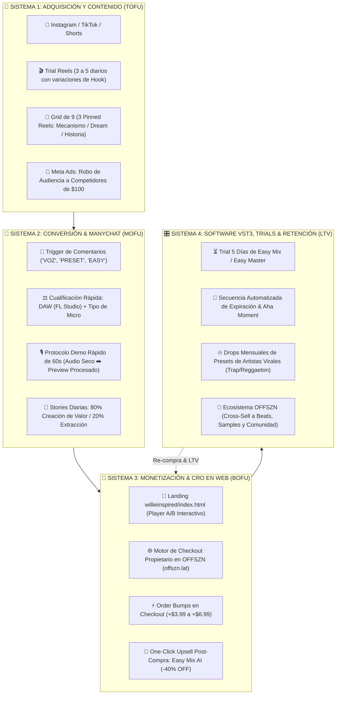

# 🗺️ MAPA VISUAL MAESTRO DE SISTEMAS — WILLIE INSPIRED
> **El Cerebro Estratégico Integrado:** Los 4 Sistemas de Escala a $100k/mes + Reporte Deep Research de Audio D2C + Datos Reales del Proyecto.

---

## 👁️ 1. EL GRAN MAPA VISUAL (MACRO-SISTEMA)

---

## 🏛️ 2. LOS 4 SISTEMAS DESGLOSADOS A FONDO

```mermaid
classDiagram
    class Sistema1_Contenido {
        +Tono: Experto, Story-based, Didáctico, Carácter
        +Bio: 3 Pilares (Promesa + Prueba + CTA Específico)
        +Trial Reels: 3-5 diarios con variaciones de Hooks
        +Grid 9: Reel 1 (Mecanismo), Reel 2 (Dream), Reel 3 (Historia)
    }
    class Sistema2_DM_Funnel {
        +Lead Magnet: Preset $0 / Limpieza
        +Scoring: FL Studio + Condensador = Lead Calificado (>=5/10)
        +Fast Demo: Template FLP pre-ruteado (15s export)
        +Objeciones: Micro barato, PC lenta, FL pirata
    }
    class Sistema3_Web_CRO {
        +Landing: Player A/B en tiempo real (Bypass vs Procesado)
        +Redirección OFFSZN: Checkout seguro y hub de herramientas
        +Order Bump: Guía EQ (+$3.99) / Master Chain (+$6.99)
        +Upsell: Easy Mix Plugin por $24 (Post-Purchase)
    }
    class Sistema4_Software_LTV {
        +Plugins VST3: Easy Mix, Easy Master, Inka Kola
        +Trial In-App: Avisos nativos días 1, 3, 5
        +Email Automation: Welcome Flow 5 días + Trial Flow
        +Drops Mensuales: Bóveda de nuevos presets y promociones
    }
```

---

## 📊 3. MATRIZ DE OFERTAS & ECONOMÍA UNITARIA

| Nivel | Producto | Precio Base | Maximizador (Order Bump / Upsell) | Ticket Promedio Esperado (AOV) |
| :--- | :--- | :--- | :--- | :--- |
| **Entrada (Lead Magnet)** | Preset Maquetas / Limpieza FL | **$0 USD** | Captura de DM en ManyChat + Email Brevo | **$0 (Lead Calificado)** |
| **Front-End (Micro-Offer)** | Preset Individual de Artista | **$5 USD** | `+ $3.99` Guía Maestra de EQ | **$8.99 USD** |
| **Core-Offer (Plantilla)** | Plantilla de Grabación & Mezcla FL | **$15 USD** | `+ $6.99` Cadena de Master Pro | **$21.99 USD** |
| **Software VST3 (Mid-Ticket)** | Licencia Perpetua **Easy Mix AI** | **$39 USD** | Upsell Post-Compra con 40% OFF (`$24 USD`) | **$39 - $49 USD** |
| **Bóveda Completa (High-Ticket)** | The Willie Vault (Easy Mix + 32 Presets) | **$67 - $97 USD** | Acceso a todos los Drops por 1 año | **$79 USD** |

---

## 📍 4. DIRECTORIO DE DOCUMENTOS EN ESTA CARPETA (`docs/cerebro_willie/`)

1. 📄 **[MAPA_VISUAL_SISTEMAS.md](file:///d:/!OFFSZN/PROYECTOS/OFFSZN/docs/cerebro_willie/MAPA_VISUAL_SISTEMAS.md)**: Este mapa conceptual maestro.
2. 📄 **[SISTEMA_1_CONTENIDO_Y_REDES.md](file:///d:/!OFFSZN/PROYECTOS/OFFSZN/docs/cerebro_willie/SISTEMA_1_CONTENIDO_Y_REDES.md)**: Estrategia de Trial Reels, Grid de 9, Stories de valor vs extracción y los 10 guiones virales.
3. 📄 **[SISTEMA_2_EMBUDO_VENTAS_Y_MANYCHAT.md](file:///d:/!OFFSZN/PROYECTOS/OFFSZN/docs/cerebro_willie/SISTEMA_2_EMBUDO_VENTAS_Y_MANYCHAT.md)**: Automatización de DMs, Scoring de Leads y Protocolo de Cierre en 60s.
4. 📄 **[SISTEMA_3_CRO_WEB_Y_ECOSISTEMA_OFFSZN.md](file:///d:/!OFFSZN/PROYECTOS/OFFSZN/docs/cerebro_willie/SISTEMA_3_CRO_WEB_Y_ECOSISTEMA_OFFSZN.md)**: Wireframe visual de la Landing de Willie, reproductor A/B y maximizadores en checkout OFFSZN.
5. 📄 **[SISTEMA_4_PLUGINS_TRIALS_Y_RETENCION.md](file:///d:/!OFFSZN/PROYECTOS/OFFSZN/docs/cerebro_willie/SISTEMA_4_PLUGINS_TRIALS_Y_RETENCION.md)**: Conversión de trials VST3, secuencias de email y lanzamientos mensuales.
