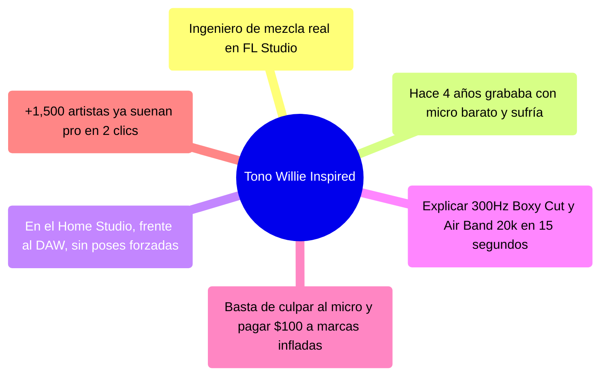
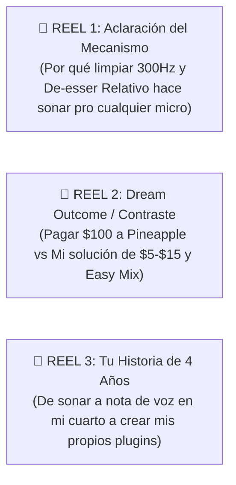
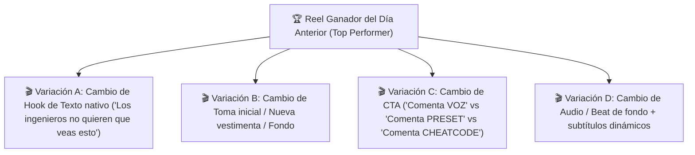

# 🎬 SISTEMA 1: ADQUISICIÓN ORGÁNICA, TRIAL REELS Y REDES SOCIALES
> **De la Atención al Dinero:** Adaptación del sistema de 6 pilares de tono, Grid de 9, Trial Reels diarios y los 10 guiones virales para **Willie Inspired**.

---

## 🎭 1. EL TONO DE MARCA (LOS 6 PILARES DE WILLIE)

Para no ser uno más del montón y no sonar a "texto de IA", el contenido de Willie Inspired se basa en:

---

## 📌 2. OPTIMIZACIÓN DE PERFIL (INSTAGRAM & TIKTOK)

### Los 3 Pilares de la Biografía:
1. **Qué haces (Promesa simplificada):** *"Te hago sonar pro en tu Home Studio en 2 clics (sin Neumann ni cuarto tratado)"*
2. **Por qué deberían escucharte (Prueba social):** *"📀 +1,500 artistas usando mi cadena de FL Studio"*
3. **CTA de valor específico:** *"🎁 Comenta 'REGALO' y te mando mi preset de limpieza nativo gratis por DM 👇"*

---

## 🖼️ 3. EL GRID DE 9: TUS 3 REELS FIJADOS (PINNED POSTS)

Las primeras 3 publicaciones son tu **VSL (Video Sales Letter) en formato Reel** para todo el tráfico frío que entra a tu perfil:

### Los otros 6 posts del Grid:
*   **2 Reels de Antes vs Después con audio real** (tu formato con mayor retención).
*   **2 Carruseles educativos / Storytelling** ("$0 Invertidos: Hoja de ruta para vender beats" / "La verdad sobre los micros baratos").
*   **2 Demostraciones visuales del Plugin Easy Mix** en acción (resolviendo una voz en 10 segundos).

---

## ⚡ 4. LA ESTRATEGIA DE TRIAL REELS (3 A 5 POR DÍA)

Instagram premia las nuevas funciones. Los **Trial Reels** permiten testear ganchos sin cansar a tus seguidores y conseguir alcance orgánico masivo gratuito:

---

## 📖 5. LA FÓRMULA DE STORIES: 80% CREAR VALOR / 20% EXTRAER VALOR

| Tipo de Historia | Propósito | Frecuencia | Ejemplos Prácticos |
| :--- | :--- | :--- | :--- |
| **Crear Valor (80%)** | Nutrición, Autoridad y Empatía | Diaria (3-5 historias) | • Pantallas de DMs con feedback de clientes. • Mini-tip en FL Studio ("Miren cómo atenúo esta resonancia"). • Encuestas de dolor ("¿Cuánto tardas mezclando una voz? A) 3 horas B) 10 min"). |
| **Extraer Valor (20%)** | Conversión Inmediata a Cash | 2-3 veces por semana | • *"Hoy tengo 5 espacios libres para hacer pruebas de audio gratis. Comenta 'DEMO' y te la hago por DM"*. |

---

## 🎙️ 6. LOS 10 GUIONES DE VIDEO CORTO LISTOS PARA GRABAR

### Bloque A: 5 Guiones para Presets y Plantillas ($5 - $15)
1.  **Guión 1: "La Ilusión del Micrófono Caro" (Hook #16)**
    *   *Visual:* Micrófono USB de $30 vs Micrófono de estudio.
    *   *Audio:* "Esto fue grabado con un micrófono de $30. Y esto también. La diferencia no es el hardware, es cómo tratas la señal en FL Studio. Mismo micro, 2 clics."
    *   *CTA:* Comenta `MICRO` y te hago la prueba con tu propia voz gratis por DM.
2.  **Guión 2: "El Error de las 3 Horas" (Hook #05)**
    *   *Visual:* Mixer caótico con 15 plugins abiertos.
    *   *Audio:* "Deja de meter 15 plugins en la mixer pensando que más es mejor. Los mejores ingenieros usan menos plugins pero en el orden correcto."
    *   *CTA:* Comenta `CADENA` y te mando mi plantilla limpia.
3.  **Guión 3: "La Razón por la que tu Voz no Encaja" (Hook #08)**
    *   *Visual:* Zoom a la frecuencia de 300Hz en el EQ.
    *   *Audio:* "Tu voz no encaja en el beat porque está peleando en los 300Hz con el bombo y el bajo. Limpias esa caja y la voz flota sola arriba del beat."
    *   *CTA:* Comenta `VOZ` para enviarte el preset.
4.  **Guión 4: "POV: Grabando en tu Habitación" (Hook #10)**
    *   *Visual:* Tú en la silla frustrado perilleando vs tú relajado al escuchar el resultado.
    *   *Texto:* "POV: Llevabas 3 horas perilleando el mixer hasta que arrastraste este preset."
    *   *CTA:* Comenta `PRESET`.
5.  **Guión 5: "De Nota de Voz a Spotify Ready" (Hook #07)**
    *   *Visual:* Pantalla dividida con waveform cruda vs procesada.
    *   *Audio:* "Así pasé de grabar voces que sonaban a notas de WhatsApp a sonar como estudio comercial desde mi cuarto."
    *   *CTA:* Comenta `PRUEBA`.

### Bloque B: 5 Guiones para Plugins Propios (Easy Mix / Easy Master)
6.  **Guión 6: "Creé mi propio Plugin porque estaba harto" (Storytelling)**
    *   *Visual:* Abres el plugin *Easy Mix* en FL Studio.
    *   *Audio:* "Estaba harto de abrir 8 plugins diferentes cada vez que quería grabar una maqueta rápida. Así que programé mi propio VST3: Easy Mix."
    *   *CTA:* Comenta `PLUGIN` y descárgate el trial gratuito de 5 días.
7.  **Guión 7: "El Plugin de 2 Clics" (Speed To Value)**
    *   *Visual:* Arrastras Easy Mix a la pista vocal, subes la perilla de Aire y Limpieza. La voz explota en calidad.
    *   *Audio:* "Clic 1: Limpia la resonancia de cuarto en 300Hz. Clic 2: Inyecta brillo de 20kHz estilo Maag EQ. Listo."
    *   *CTA:* Comenta `EASY` para probarlo hoy.
8.  **Guión 8: "Por qué las grandes marcas te cobran $100+" (Contraste)**
    *   *Visual:* Capturas de plugins de $150 vs la interfaz elegante y limpia de Easy Mix.
    *   *Audio:* "No necesitas pagar $100 dólares a marcas gringas para tener un de-esser relativo y reverb estéreo con ducking. Diseñé Easy Mix para que cualquier artista de home studio pueda permitírselo."
    *   *CTA:* Comenta `EASYMIX`.
9.  **Guión 9: "La Perilla Secreta de los 20k (Air Band)"**
    *   *Visual:* Zoom al knob de Brillo Fino del plugin.
    *   *Audio:* "Este es el truco que usan en los discos de Trap y R&B para que la voz tenga ese brillo caro sin sonar chillona."
    *   *CTA:* Comenta `BRILLO` para enviarte el plugin.
10. **Guión 10: "Prueba a Ciegas: Plugin Pro vs Cadena de 10 Plugins"**
    *   *Visual:* A/B Test en tiempo real.
    *   *Audio:* "¿Puedes notar la diferencia entre una cadena de $500 en plugins y 1 solo plugin en mi canal de voz? Escucha esto."
    *   *CTA:* Comenta `TRIAL` para el enlace de descarga directa.
