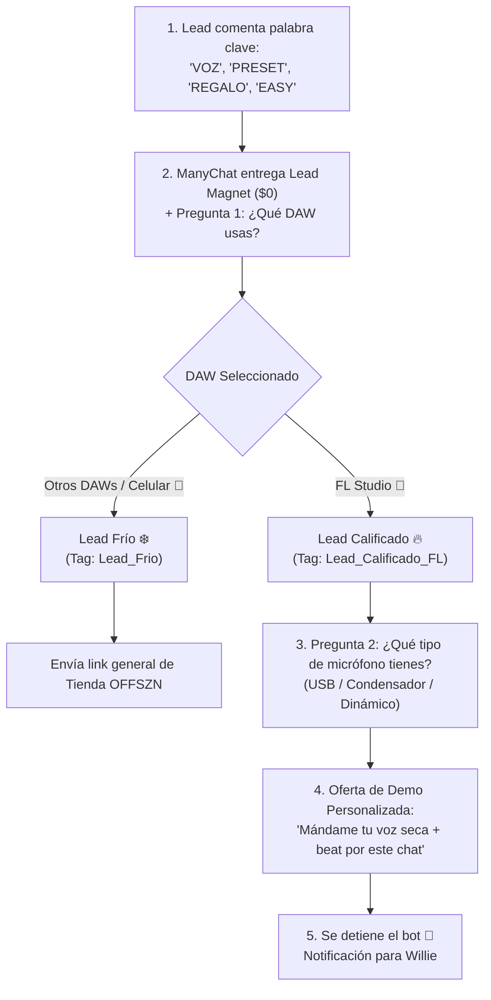
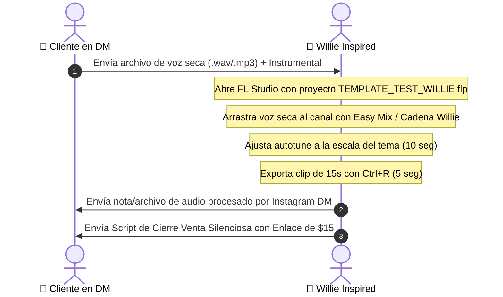

# 💬 SISTEMA 2: EMBUDO DE CONVERSIÓN EN DMs, MANYCHAT & CIERRES
> **De la Conversación al Cash:** Automatización inteligente de cualificación, protocolo de demo en 60 segundos y manejo de objeciones para Willie Inspired.

---

## 🤖 1. EL FLUJO LÓGICO DE MANYCHAT

Para que no pierdas tiempo respondiendo a usuarios que no usan FL Studio o que solo buscan cosas gratis sin intención de compra, ManyChat actúa como un **filtro de cualificación**:

---

## 🎙️ 2. EL PROTOCOLO DE DEMO RÁPIDO DE 60 SEGUNDOS (PARA WILLIE)

Para no saturarte cuando recibas 20 audios diarios por DM:

### ✍️ Script de Cierre por DM (Copy-Paste):
> *"¡Ahí te lo mandé hermano! 🎧 Escúchalo con audífonos.  
> Básicamente limpié la resonancia de cuarto en 300Hz, controlé los picos con el de-esser relativo y le inyecté el brillo fino estéreo de 20k.  
>   
> Como ves, el micro no era el problema. Si quieres tener esta misma cadena lista para usar en todos tus temas en 2 clics, te dejo el enlace de la plantilla completa de OFFSZN por solo $15 dólares: [ENLACE_CHECKOUT]  
>   
> Si te la llevas hoy, cualquier duda de instalación me avisas por aquí y te ayudo."*

---

## 🛡️ 3. MANEJO MAESTRO DE OBJECIONES (SCRIPTS DE RESPUESTA)

| Objeción del Cliente | Lo que realmente piensa | Script de Respuesta de Willie |
| :--- | :--- | :--- |
| **"No tengo dinero"** | *"No sé si esto realmente me va a servir"* | *"Tranquilo bro, te entiendo perfectamente. Por eso mismo te hice la prueba gratis primero para que escuches que con tu micro actual sí se puede sonar pro. El preset te sale $5 (menos de lo que cuesta un combo de comida) y te ahorra meses de frustración. Cuando estés listo me avisas."* |
| **"Mi PC es de bajos recursos"** | *"Tengo miedo de que me de lag en FL"* | *"Hermano, precisamente por eso diseñé Easy Mix y mis plantillas con ruteo optimizado en C++ y JUCE. No consume casi nada de CPU porque usa 1 sola instancia en vez de 12 plugins abiertos. Te va a correr fluido."* |
| **"Uso FL Studio crackeado o versión antigua"** | *"¿Será compatible?"* | *"Funciona perfectamente desde FL Studio 20 y 21 en adelante. Los presets son nativos y el plugin viene con su propio instalador automático en Windows y Mac."* |
| **"¿Y si no me gusta cómo queda?"** | *"Miedo a perder el dinero"* | *"Bro, si me compraste la plantilla y tienes dudas, me mandas captura de tu mixer y yo mismo te ayudo a calibrarla por DM hasta que tu voz suene exactamente como quieres."* |

---

## 📊 4. TRACKING INVERSO & PIPELINE DE LEADS

Para saber exactamente qué video o anuncio trajo las ventas:
1.  **Etiquetado por Trigger:** Cada palabra clave identifica el origen (`VOZ_REEL_32`, `MICRO_TIKTOK_ANTES`, `EASYMIX_PROMO`).
2.  **Score del Lead (1 al 10):**
    *   **Score 8-10:** Usa FL Studio + Envió audio seco + Respondió en <10 minutos. (Prioridad absoluta de cierre).
    *   **Score 5-7:** Usa FL Studio pero aún no envía el audio. (Enviar recordatorio a las 24 horas: *"Bro, ¿pudiste grabar la toma seca para tu prueba?"*).
    *   **Score 1-4:** Usa celular / BandLab. (Se le envía a la tienda general de OFFSZN).
