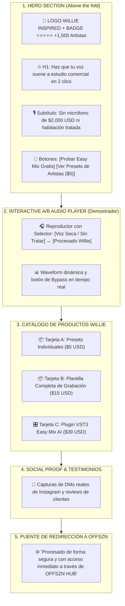
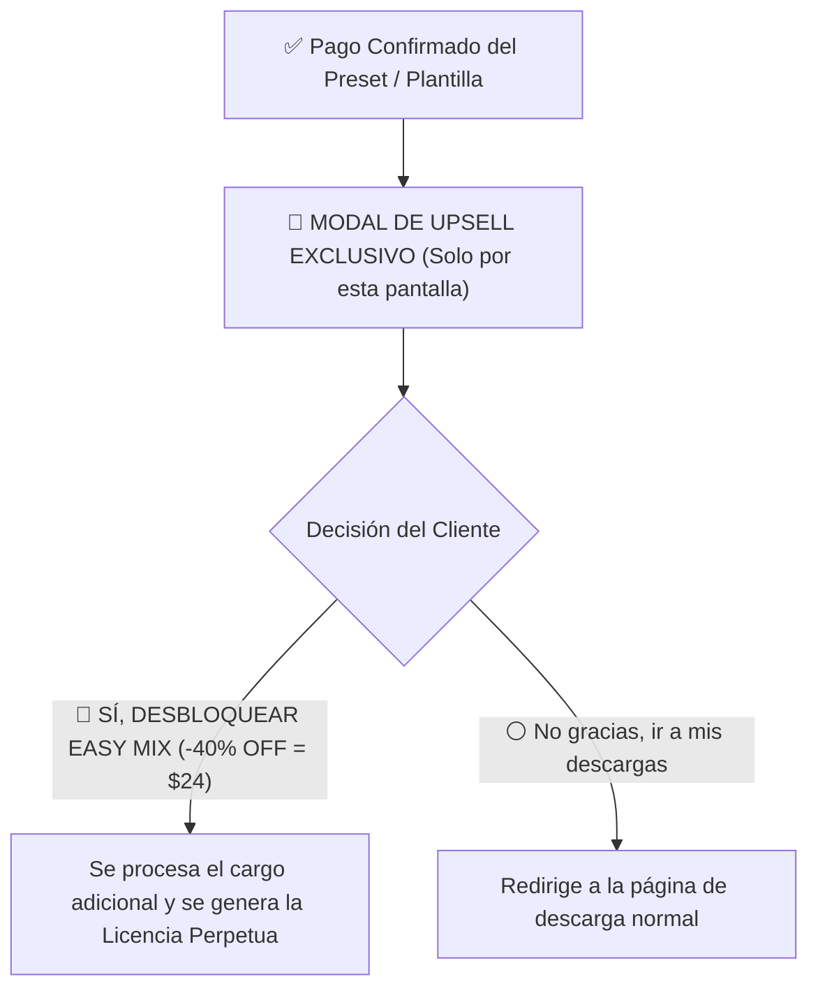

# 🛒 SISTEMA 3: ARQUITECTURA WEB (CRO), CHECKOUT & REDIRECCIÓN A OFFSZN
> **De la Visita a la Compra:** Estructura visual de la Landing de Willie, reproductor A/B interactivo, Order Bumps y el puente hacia OFFSZN.

---

## 🎨 1. WIREFRAME VISUAL DE LA LANDING (`willieinspired/index.html`)



---

## ⚡ 2. MAXIMIZADORES DE CHECKOUT EN OFFSZN (AOV BOOSTERS)

Como tenemos control total del código en [script/checkout.js](file:///d:/!OFFSZN/PROYECTOS/OFFSZN/script/checkout.js) y [script/plugin-checkout.js](file:///d:/!OFFSZN/PROYECTOS/OFFSZN/script/plugin-checkout.js):

### A. Order Bumps en la Pantalla de Pago
Un checkbox de 1 clic situado justo antes del botón de *"Comprar con Tarjeta / MercadoPago / PayPal"*:

```html
<!-- Ejemplo de UI para el Order Bump -->
<div class="order-bump-card" style="border: 2px dashed #ff5500; padding: 14px; background: rgba(255,85,0,0.05); border-radius: 12px;">
    <label style="display: flex; gap: 10px; cursor: pointer; align-items: center;">
        <input type="checkbox" id="bump-eq-guide" style="width: 20px; height: 20px;">
        <div>
            <span style="font-weight: 700; color: #ff5500;">¡OFERTA EXCLUSIVA DE 1 CLIC!</span>
            <p style="margin: 0; font-size: 13px; color: #ccc;">
                Añade la <strong>Guía Maestra de EQ + Checklist de Grabación</strong> por solo <strong>+$3.99 USD</strong> (Precio regular: $12).
            </p>
        </div>
    </label>
</div>
```

*   **Impacto medido en la industria (SamCart):** Convierte entre el **30% y 40%** de los compradores y eleva el ticket promedio inmediatamente.

---

### B. One-Click Upsell Post-Compra (Modal de Agradecimiento)
Inmediatamente tras confirmarse el pago de un preset ($5) o plantilla ($15), antes de que el usuario descargue sus archivos, aparece una ventana modal de alto impacto:



---

## 🌐 3. LA REDIRECCIÓN INTELIGENTE AL HUB DE OFFSZN

Para que el cliente no compre un preset y se vaya para siempre, la página de confirmación y el correo de entrega lo invitan al ecosistema de **OFFSZN**:

1.  **Banner de Bienvenida a OFFSZN:**
    > *"Tu preset ha sido añadido a tu biblioteca digital en OFFSZN. Ahora tienes acceso a descargar futuros updates, explorar beats exclusivos y probar nuestros plugins VST3."*
2.  **Cross-Selling en la Biblioteca:**
    *   Dentro de `mis-compras.html`, debajo de sus presets descargados, aparecen tarjetas recomendadas:
        *   *"¿Quieres masterizar tu canción? Prueba Easy Master con 3 días gratis"*.
        *   *"Explora Beats y Samples libres de royalties en OFFSZN"*.
