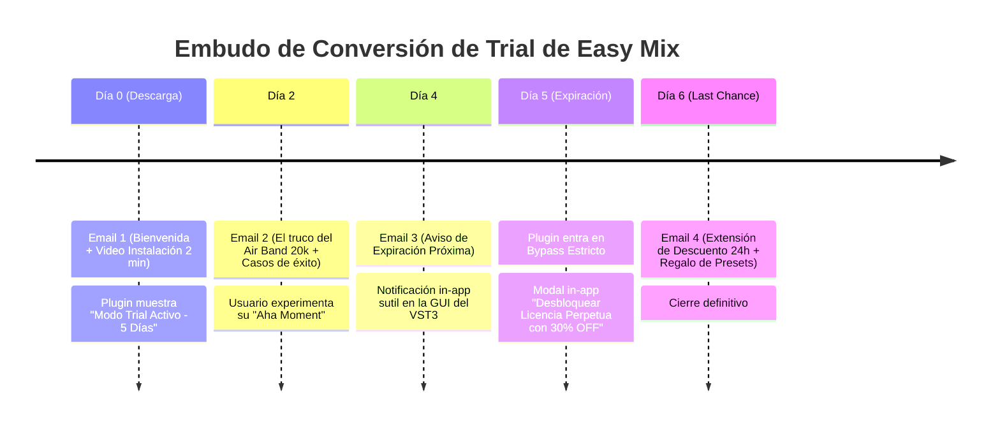
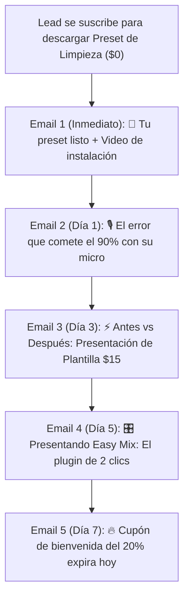
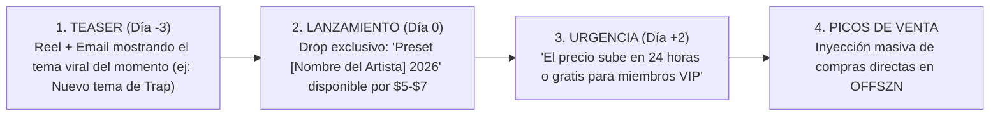

# 🎛️ SISTEMA 4: SOFTWARE VST3, CONVERSIÓN DE TRIALS & LTV
> **Del Software a la Recurrencia:** Ciclo de vida de los plugins de audio, secuencias de email de conversión y la estrategia de Drops Mensuales.

---

## ⏳ 1. EL CICLO DE VIDA DEL TRIAL DE EASY MIX (5 A 7 DÍAS)

Basado en las mejores prácticas de SaaS y marcas líderes de audio (Slate Digital, Joey Sturgis Tones), el embudo de conversión del plugin no depende de la suerte:

---

## 📧 2. SECUENCIAS DE EMAIL AUTOMATIZADAS (CONFIGURACIÓN EN BREVO)

### A. Secuencia de Bienvenida para Leads de Presets Gratuitos (Welcome Flow)

---

## 🔥 3. LA ESTRATEGIA DE "DROPS MENSUALES" (PICOS RECURRENTES DE CASH)

Para no depender únicamente de captar nuevos seguidores todos los días, se monetiza la base de datos existente mediante lanzamientos programados:

---

## 💎 4. LTV Y COMUNIDAD EXCLUSIVA

*   **Paso de Comprador Ocasional a Fan Fiel:**
    *   Todo comprador de una plantilla o plugin recibe acceso al canal privado de anuncios / Telegram de Willie Inspired.
    *   Se realizan sesiones mensuales de feedback en vivo ("Mándame tu tema y lo revisamos en directo").
    *   Esto genera una retención altísima y prepara el terreno para membresías o bundles de suscripción recurrente en el futuro.
